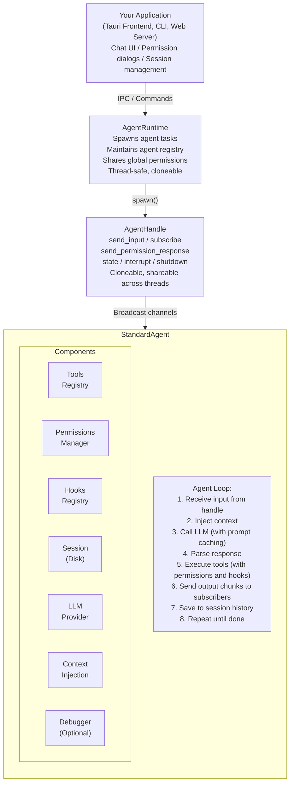
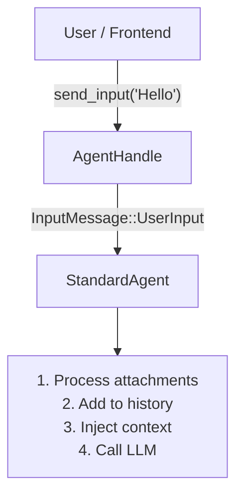
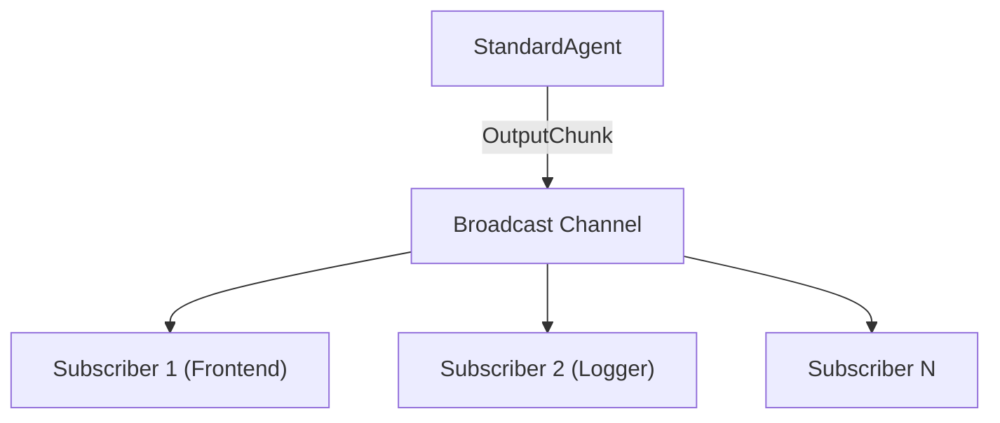
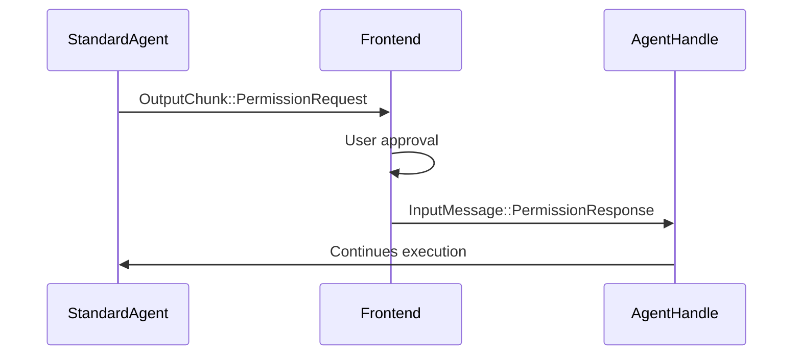
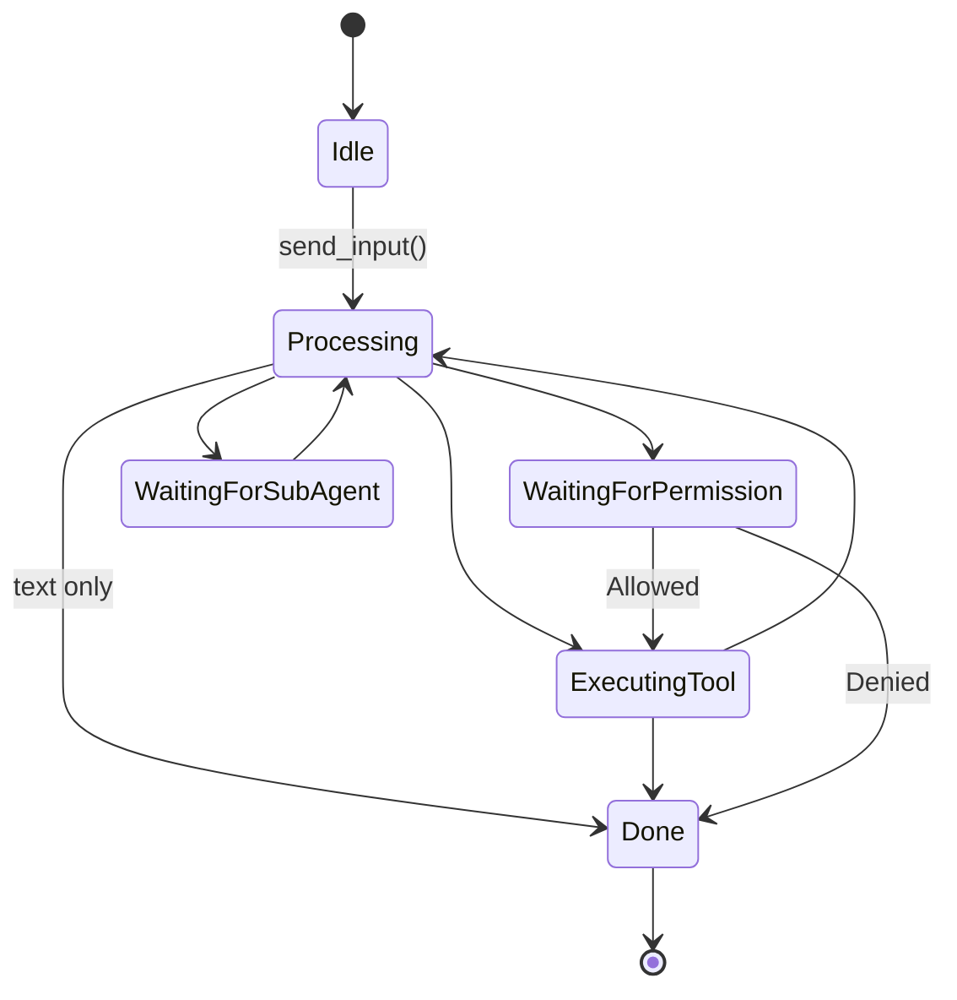

## System Architecture

Shadow Agent SDK is built with a clear separation of concerns, designed specifically for frontend-backend applications like Tauri desktop apps.



## Core Components

### AgentRuntime

The **AgentRuntime** is the orchestrator. It:

- Spawns agents as independent async tasks
- Maintains a registry of running agents by session ID
- Provides global permission rules shared across all agents
- Handles agent lifecycle (spawn, get, shutdown)

**Key Characteristics:**
- Thread-safe (can be shared across threads)
- Single runtime can manage hundreds of agents
- Each agent runs independently

```rust
let runtime = AgentRuntime::new();

// Spawn an agent
let handle = runtime.spawn(session, |internals| agent.run(internals)).await;

// Get existing agent
let handle = runtime.get("session-id").await;

// List running agents
let running = runtime.list_running().await;
```

### AgentHandle

The **AgentHandle** is your interface to a running agent. It:

- Sends input to the agent
- Subscribes to output streams
- Sends permission responses
- Checks agent state
- Can interrupt or shutdown the agent

**Key Characteristics:**
- Cloneable (can be shared across threads/tasks)
- Non-blocking operations
- Channel-based communication

```rust
// Send input
handle.send_input("Hello").await?;

// Subscribe to output
let mut rx = handle.subscribe();

// Check state
let state = handle.state().await;

// Control agent
handle.interrupt().await;
handle.shutdown().await;
```

### StandardAgent

The **StandardAgent** is the brains. It:

- Implements the main agent loop
- Manages conversation with the LLM
- Executes tools with permissions
- Streams output to subscribers
- Persists conversation history

**Key Characteristics:**
- Stateful (maintains conversation context)
- Async-first architecture
- Extensible through hooks and context injection

### AgentSession

The **AgentSession** handles persistence. It:

- Stores conversation history on disk
- Maintains session metadata
- Supports parent-child relationships (for subagents)
- Provides conversation naming

**Key Characteristics:**
- Write-through persistence (immediate disk writes)
- Stored in `./sessions/{session_id}/`
- JSON format for portability

```rust
// Create session
let session = AgentSession::new(
    "session-123",
    "assistant",
    "My Assistant",
    "Description",
)?;

// Load existing
let session = AgentSession::load("session-123")?;

// Get history without loading full session
let history = AgentSession::get_history("session-123")?;
```

## Communication Flow

### Input Flow



### Output Flow



### Permission Flow



## Data Flow

### Dual-Channel Architecture

The SDK uses a **dual-channel** approach for conversation data:

**1. Stream (Ephemeral)**
- Real-time output via broadcast channels
- Fast, in-memory
- Lost if no subscribers
- Perfect for live UIs

**2. History (Persistent)**
- Disk-based storage
- Durable, reliable
- Always available
- Ground truth for conversation state

<Warning>
**Critical Pattern**: Always subscribe BEFORE sending input, or you'll miss early output chunks!

```rust
// Correct order
let mut rx = handle.subscribe();  // Subscribe first
handle.send_input("Hello").await?;  // Then send

// Wrong order
handle.send_input("Hello").await?;
let mut rx = handle.subscribe();  // Too late!
```
</Warning>

## Agent Lifecycle

### States

```rust
pub enum AgentState {
    Idle,                          // Waiting for input
    Processing,                    // Calling LLM
    WaitingForPermission,          // Awaiting user approval
    ExecutingTool {                // Running a tool
        tool_name: String,
        tool_use_id: String,
    },
    WaitingForSubAgent {           // Subagent spawned
        session_id: String,
    },
    WaitingForUserInput {          // AskUserQuestion pending
        request_id: String,
    },
    Done,                          // Completed
    Error { message: String },     // Failed
}
```

### State Transitions



## Threading Model

### Async Tasks

Each agent runs as an independent `tokio::task`:

```rust
// Spawning creates a new task
let handle = runtime.spawn(session, |internals| agent.run(internals)).await;

// Agent runs on tokio runtime
tokio::spawn(async move {
    agent.run(internals).await
});
```

### Thread Safety

- **AgentRuntime**: `Arc` wrapping for shared access
- **AgentHandle**: Cloneable, uses channels for communication
- **Tools**: Must be `Send + Sync`
- **Sessions**: Write-through to disk, no shared state

### Concurrent Access

Multiple threads can safely:
- Send input to the same agent
- Subscribe to agent output
- Check agent state
- Access different agents simultaneously

## Memory Model

### What's In-Memory

- Current conversation context (for LLM calls)
- Broadcast channel buffers (recent output chunks)
- Permission rules (session, local, global)
- Tool registry
- MCP connections

### What's On-Disk

- Complete conversation history (`./sessions/{id}/history.json`)
- Session metadata (`./sessions/{id}/metadata.json`)
- Debug logs (if enabled, `./sessions/{id}/debugger/`)

### Memory Efficiency

- Prompt caching reduces redundant LLM processing
- Sessions are loaded on-demand
- History is only read when needed
- Broadcast channels have bounded buffers

## Extensibility Points

### 1. Custom Tools

Implement the `Tool` trait:

```rust
#[async_trait]
impl Tool for MyTool {
    fn name(&self) -> &str { "MyTool" }
    fn description(&self) -> &str { "..." }
    fn definition(&self) -> ToolDefinition { ... }
    async fn execute(&self, input: &Value, internals: &mut AgentInternals) -> Result<ToolResult> {
        // Your logic
    }
}
```

### 2. Hooks

Intercept agent behavior:

```rust
hooks.add(HookEvent::PreToolUse, |ctx| {
    // Modify or block tool execution
    HookResult::allow()
});
```

### 3. Context Injection

Add dynamic context to LLM calls:

```rust
chain.add_fn("timestamp", |internals, messages| {
    let time = chrono::Utc::now();
    inject_system_reminder(messages, &format!("Current time: {}", time));
});
```

### 4. Custom LLM Providers

Implement the `LlmProvider` trait:

```rust
#[async_trait]
impl LlmProvider for MyProvider {
    async fn send_message(&self, ...) -> Result<MessageResponse> {
        // Call your LLM API
    }
}
```

### 5. MCP Servers

Connect external tool providers:

```rust
let mcp = MCPClient::connect("http://localhost:8005/mcp").await?;
mcp_manager.add_service("filesystem", mcp).await?;
```

## Design Principles

### 1. Frontend-First

The architecture prioritizes responsive UIs:
- Streaming output for real-time feedback
- Non-blocking permission requests
- State visibility for UI updates

### 2. Type Safety

Rust's type system prevents entire classes of errors:
- Compile-time verification
- No null pointer exceptions
- Memory safety guarantees

### 3. Production-Ready

Built for real applications:
- Session persistence (survive crashes)
- Permission system (security)
- Error handling (graceful degradation)
- Debugger (troubleshooting)

### 4. Flexibility

Easy to customize and extend:
- Pluggable LLM providers
- Custom tools
- Hook system
- Context injection

### 5. Performance

Optimized for efficiency:
- Async I/O (non-blocking)
- Prompt caching (90% cost reduction)
- Connection pooling
- Minimal allocations

## Comparison with Other Architectures

### vs. Stateless Request/Response

**Shadow Agent SDK:**
- Maintains conversation state
- Session persistence
- Multi-turn interactions

**Stateless:**
- No state between requests
- Must send full history each time
- Simpler but less capable

### vs. Monolithic Agent

**Shadow Agent SDK:**
- Multiple independent agents
- Subagent spawning
- Runtime management

**Monolithic:**
- Single agent instance
- No isolation
- Harder to scale

### vs. Microservices

**Shadow Agent SDK:**
- Embedded in your application
- Type-safe communication
- No network overhead

**Microservices:**
- Separate services
- Network communication
- More operational complexity

## Next Steps

Now that you understand the architecture:

<CardGroup cols={2}>
  <Card
    title="Runtime & Lifecycle"
    href="/concepts/runtime"
  >
    Deep dive into AgentRuntime and agent lifecycle
  </Card>
  <Card
    title="Sessions & Persistence"
    href="/concepts/sessions"
  >
    Learn about conversation persistence
  </Card>
  <Card
    title="Message Flow"
    href="/concepts/message-flow"
  >
    Understand input/output communication
  </Card>
  <Card
    title="Agent States"
    href="/concepts/states"
  >
    Explore all agent states and transitions
  </Card>
</CardGroup>
