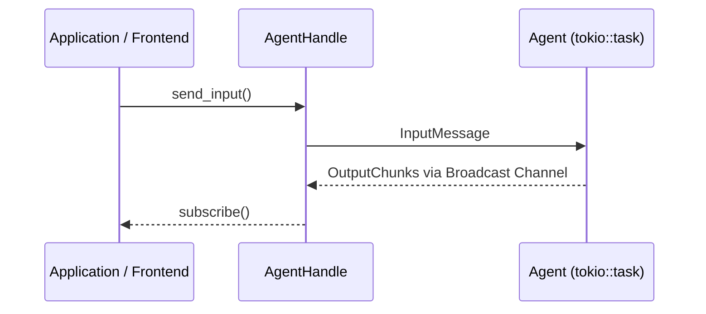
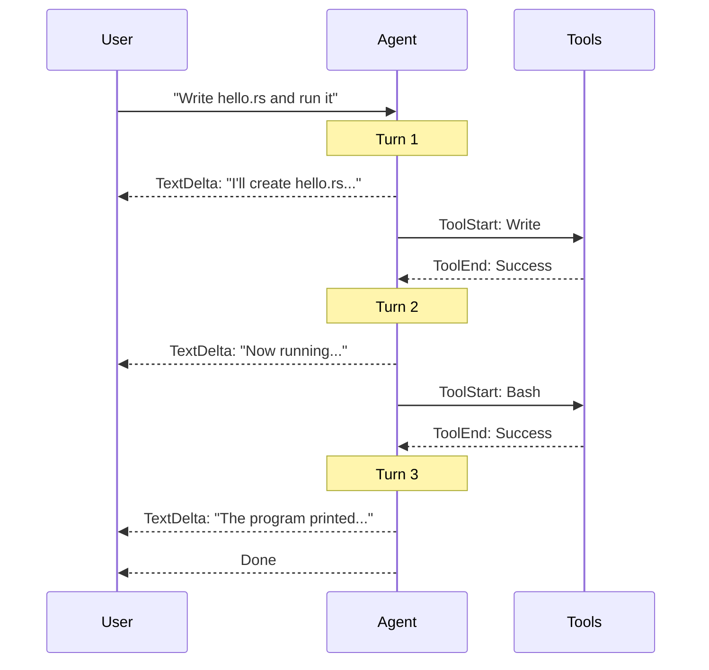
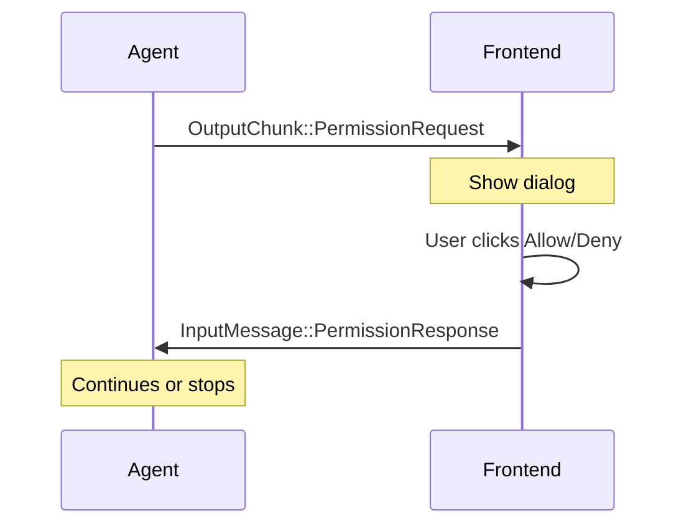
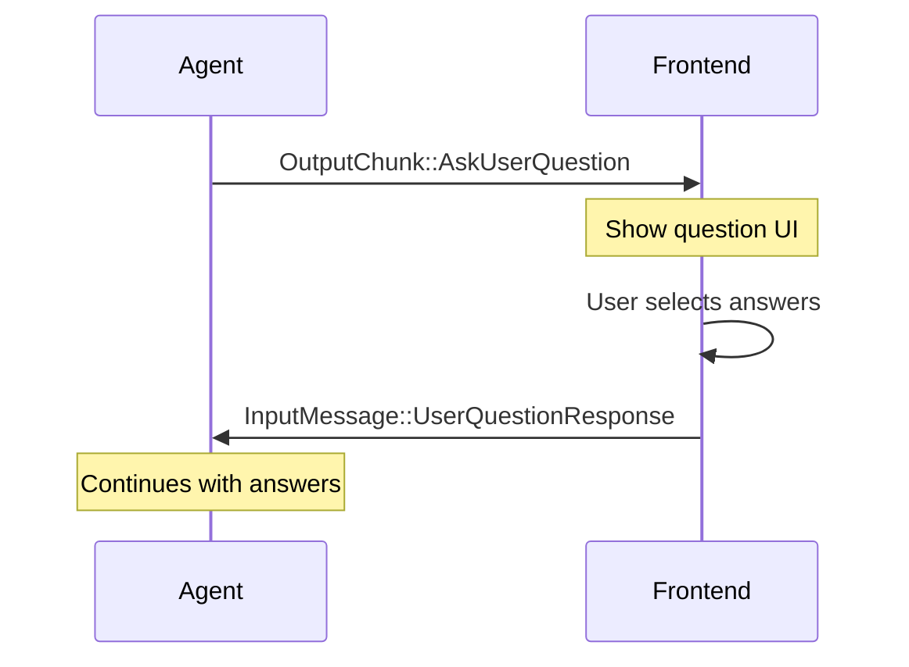
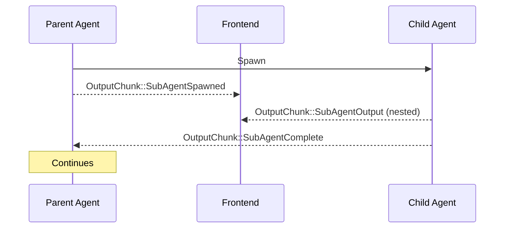
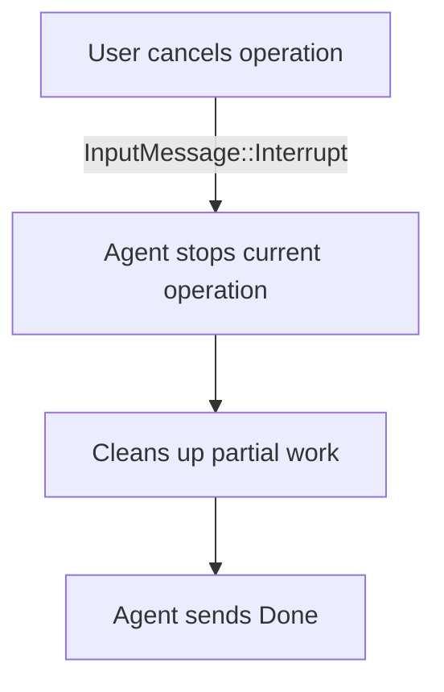

## Communication Architecture

Shadow Agent SDK uses **channels** for bidirectional communication between your application and running agents.



## Input Messages

### InputMessage Enum

Messages sent TO the agent:

```rust
pub enum InputMessage {
    UserInput(String),
    ToolResult {
        tool_use_id: String,
        result: ToolResult,
    },
    PermissionResponse {
        tool_name: String,
        allowed: bool,
        remember: bool,
    },
    UserQuestionResponse {
        request_id: String,
        answers: HashMap<String, String>,
    },
    SubAgentComplete {
        session_id: String,
        result: Option<String>,
    },
    Interrupt,
    Shutdown,
}
```

### Sending Input

```rust
// User input (most common)
handle.send_input("Write a hello world program").await?;

// Permission response
handle.send_permission_response("Bash", true, false).await?;

// Tool result (for async tools)
handle.send(InputMessage::ToolResult {
    tool_use_id: "tool_123".to_string(),
    result: ToolResult::success("Done"),
}).await?;

// User question response
handle.send(InputMessage::UserQuestionResponse {
    request_id: "req_123".to_string(),
    answers: HashMap::from([
        ("Auth".to_string(), "JWT".to_string()),
    ]),
}).await?;

// Control messages
handle.send(InputMessage::Interrupt).await?;
handle.send(InputMessage::Shutdown).await?;
```

## Output Messages

### OutputChunk Enum

Messages sent FROM the agent:

```rust
pub enum OutputChunk {
    TextDelta(String),
    TextComplete(String),
    ThinkingDelta(String),
    ThinkingComplete(String),
    ToolStart {
        id: String,
        name: String,
        input: serde_json::Value,
    },
    ToolProgress {
        id: String,
        output: String,
    },
    ToolEnd {
        id: String,
        result: ToolResult,
    },
    PermissionRequest {
        tool_name: String,
        action: String,
        input: serde_json::Value,
        details: Option<String>,
    },
    AskUserQuestion {
        request_id: String,
        questions: Vec<UserQuestion>,
    },
    SubAgentSpawned {
        session_id: String,
        agent_type: String,
    },
    SubAgentOutput {
        session_id: String,
        chunk: Box<OutputChunk>,
    },
    SubAgentComplete {
        session_id: String,
        result: Option<String>,
    },
    StateChange(AgentState),
    Status(String),
    Error(String),
    Done,
}
```

### Receiving Output

```rust
// Subscribe to output stream
let mut rx = handle.subscribe();

while let Ok(chunk) = rx.recv().await {
    match chunk {
        OutputChunk::TextDelta(text) => {
            // Stream text token
            print!("{}", text);
        }

        OutputChunk::ToolStart { name, input, .. } => {
            // Tool execution started
            println!("\n[Using tool: {}]", name);
        }

        OutputChunk::PermissionRequest { tool_name, action, .. } => {
            // Permission needed
            println!("Permission: {} wants to {}", tool_name, action);
            handle.send_permission_response(tool_name, true, false).await?;
        }

        OutputChunk::StateChange(state) => {
            // Agent state changed
            update_ui_state(state);
        }

        OutputChunk::Error(message) => {
            // Error occurred
            eprintln!("Error: {}", message);
        }

        OutputChunk::Done => {
            // Agent finished
            break;
        }

        _ => {}
    }
}
```

## Critical Pattern: Subscribe Before Send

<Warning>
**Always subscribe to the output stream BEFORE sending input**, or you'll miss early output chunks!
</Warning>

### Correct Order

```rust
// 1. Subscribe first
let mut rx = handle.subscribe();

// 2. Then send input
handle.send_input("Hello").await?;

// 3. Process output
while let Ok(chunk) = rx.recv().await {
    // Handle chunks
}
```

### Wrong Order

```rust
// Wrong: Send first
handle.send_input("Hello").await?;

// Too late! You missed early chunks
let mut rx = handle.subscribe();
```

### Why This Matters

Agents start processing immediately when they receive input. If you subscribe after sending, you'll miss:
- Early text tokens
- Tool execution notifications
- State changes
- Permission requests

### The Foolproof Pattern

```rust
async fn interact_with_agent(
    handle: &AgentHandle,
    user_input: &str,
) -> Result<String> {
    // 1. Subscribe
    let mut rx = handle.subscribe();

    // 2. Send
    handle.send_input(user_input).await?;

    // 3. Process
    let mut response = String::new();

    while let Ok(chunk) = rx.recv().await {
        match chunk {
            OutputChunk::TextDelta(text) => {
                response.push_str(&text);
                print!("{}", text);  // Live streaming
            }
            OutputChunk::Done => break,
            _ => {}
        }
    }

    Ok(response)
}
```

## Multiple Subscribers

Multiple parts of your application can subscribe to the same agent:

```rust
// Frontend UI subscriber
let mut rx1 = handle.subscribe();
tokio::spawn(async move {
    while let Ok(chunk) = rx1.recv().await {
        update_ui(chunk);
    }
});

// Logger subscriber
let mut rx2 = handle.subscribe();
tokio::spawn(async move {
    while let Ok(chunk) = rx2.recv().await {
        log_output(chunk);
    }
});

// Analytics subscriber
let mut rx3 = handle.subscribe();
tokio::spawn(async move {
    while let Ok(chunk) = rx3.recv().await {
        track_event(chunk);
    }
});

// All receive the same chunks
handle.send_input("Hello").await?;
```

## Message Processing Patterns

### Simple Echo

```rust
let mut rx = handle.subscribe();
handle.send_input("Hello").await?;

while let Ok(chunk) = rx.recv().await {
    match chunk {
        OutputChunk::TextDelta(text) => print!("{}", text),
        OutputChunk::Done => break,
        _ => {}
    }
}
```

### Collect Full Response

```rust
let mut rx = handle.subscribe();
handle.send_input("Explain Rust").await?;

let mut full_response = String::new();

while let Ok(chunk) = rx.recv().await {
    match chunk {
        OutputChunk::TextDelta(text) => {
            full_response.push_str(&text);
        }
        OutputChunk::TextComplete(text) => {
            full_response = text;
        }
        OutputChunk::Done => break,
        _ => {}
    }
}

println!("Full response: {}", full_response);
```

### Handle All Events

```rust
let mut rx = handle.subscribe();
handle.send_input("Read file.txt").await?;

while let Ok(chunk) = rx.recv().await {
    match chunk {
        OutputChunk::TextDelta(text) => {
            ui.append_text(text);
        }

        OutputChunk::ThinkingDelta(thinking) => {
            ui.show_thinking(thinking);
        }

        OutputChunk::ToolStart { name, .. } => {
            ui.show_tool_indicator(name);
        }

        OutputChunk::ToolEnd { result, .. } => {
            ui.hide_tool_indicator();
        }

        OutputChunk::PermissionRequest { tool_name, action, .. } => {
            let allowed = ui.show_permission_dialog(tool_name, action);
            handle.send_permission_response(tool_name, allowed, false).await?;
        }

        OutputChunk::StateChange(state) => {
            ui.update_state_indicator(state);
        }

        OutputChunk::Error(message) => {
            ui.show_error(message);
        }

        OutputChunk::Done => {
            ui.set_input_enabled(true);
            break;
        }

        _ => {}
    }
}
```

## Multi-Turn Conversations

A single user input can trigger multiple LLM calls:



Handle this naturally:

```rust
let mut rx = handle.subscribe();
handle.send_input("Write hello.rs and run it").await?;

// Just keep processing until Done
while let Ok(chunk) = rx.recv().await {
    match chunk {
        OutputChunk::TextDelta(text) => print!("{}", text),
        OutputChunk::ToolStart { name, .. } => {
            println!("\n[Tool: {}]", name);
        }
        OutputChunk::Done => break,
        _ => {}
    }
}
```

## Permission Flow

### Request-Response Pattern



### Implementation

```rust
let mut rx = handle.subscribe();
handle.send_input("Delete all files").await?;

while let Ok(chunk) = rx.recv().await {
    match chunk {
        OutputChunk::PermissionRequest {
            tool_name,
            action,
            input,
            details
        } => {
            // Show permission dialog
            println!("Permission needed:");
            println!("  Tool: {}", tool_name);
            println!("  Action: {}", action);
            println!("  Input: {}", input);

            // Get user decision (blocking in real app)
            print!("Allow? (y/n): ");
            let mut response = String::new();
            std::io::stdin().read_line(&mut response)?;

            let allowed = response.trim().eq_ignore_ascii_case("y");

            // Send response
            handle.send_permission_response(
                tool_name,
                allowed,
                false  // remember
            ).await?;
        }

        OutputChunk::Done => break,
        _ => {}
    }
}
```

## Ask User Questions Flow

### Interactive Questions



### Implementation

```rust
let mut rx = handle.subscribe();
handle.send_input("Implement authentication").await?;

while let Ok(chunk) = rx.recv().await {
    match chunk {
        OutputChunk::AskUserQuestion { request_id, questions } => {
            println!("Agent has questions:");

            let mut answers = HashMap::new();

            for question in questions {
                println!("\n{}", question.question);
                for (i, option) in question.options.iter().enumerate() {
                    println!("  {}. {} - {}", i + 1, option.label, option.description);
                }

                // Get user selection
                print!("Select (1-{}): ", question.options.len());
                let mut input = String::new();
                std::io::stdin().read_line(&mut input)?;

                let index: usize = input.trim().parse().unwrap_or(1) - 1;
                let selected = &question.options[index];

                answers.insert(
                    question.header.clone(),
                    selected.label.clone(),
                );
            }

            // Send answers
            handle.send(InputMessage::UserQuestionResponse {
                request_id,
                answers,
            }).await?;
        }

        OutputChunk::Done => break,
        _ => {}
    }
}
```

## Subagent Flow

### Parent-Child Communication



### Implementation

```rust
let mut rx = handle.subscribe();
handle.send_input("Research and summarize topic X").await?;

while let Ok(chunk) = rx.recv().await {
    match chunk {
        OutputChunk::SubAgentSpawned { session_id, agent_type } => {
            println!("Spawned subagent: {} ({})", session_id, agent_type);

            // Optionally subscribe to subagent
            if let Some(child_handle) = runtime.get(&session_id).await {
                let mut child_rx = child_handle.subscribe();
                tokio::spawn(async move {
                    while let Ok(child_chunk) = child_rx.recv().await {
                        println!("  [Child]: {:?}", child_chunk);
                    }
                });
            }
        }

        OutputChunk::SubAgentOutput { session_id, chunk } => {
            println!("[Subagent {}]: {:?}", session_id, chunk);
        }

        OutputChunk::SubAgentComplete { session_id, result } => {
            println!("Subagent {} completed: {:?}", session_id, result);
        }

        OutputChunk::Done => break,
        _ => {}
    }
}
```

## Interrupt Flow

### Graceful Cancellation



### Implementation

```rust
let mut rx = handle.subscribe();
handle.send_input("Generate 1000 files").await?;

// User clicks cancel after 2 seconds
tokio::spawn({
    let handle = handle.clone();
    async move {
        tokio::time::sleep(Duration::from_secs(2)).await;
        handle.send(InputMessage::Interrupt).await.ok();
    }
});

while let Ok(chunk) = rx.recv().await {
    match chunk {
        OutputChunk::Done => {
            println!("Operation stopped");
            break;
        }
        _ => {}
    }
}
```

## Channel Characteristics

### Broadcast Channels

Output uses `tokio::sync::broadcast`:

- **Multiple subscribers**: Many receivers get same messages
- **Bounded buffer**: Configurable capacity (default: 1024)
- **Lagging behavior**: Slow subscribers may miss messages
- **Clonable**: Call `subscribe()` multiple times

### MPSC Channels

Input uses `tokio::sync::mpsc`:

- **Single consumer**: Only the agent receives
- **Unbounded**: Won't block senders
- **Order preserved**: FIFO message delivery
- **Clonable sender**: Multiple parts can send

## Performance Considerations

### Buffer Size

Default broadcast buffer is 1024 messages:

```rust
// Most applications don't need to change this
// But you can if needed:
const BROADCAST_CAPACITY: usize = 2048;
```

### Subscriber Lag

If a subscriber is slow, it may miss messages:

```rust
match rx.recv().await {
    Ok(chunk) => {
        // Process chunk
    }
    Err(tokio::sync::broadcast::error::RecvError::Lagged(n)) => {
        eprintln!("Missed {} messages due to slow processing", n);
    }
    Err(_) => {
        // Channel closed
        break;
    }
}
```

### Backpressure

The system doesn't implement backpressure. Fast producers continue regardless of slow consumers. Use fast async processing to keep up.

## Best Practices

### 1. Subscribe Early

```rust
// Good
let mut rx = handle.subscribe();
handle.send_input("task").await?;

// Bad
handle.send_input("task").await?;
let mut rx = handle.subscribe();  // Missed early output
```

### 2. Handle All Cases

```rust
match chunk {
    OutputChunk::TextDelta(text) => { /* ... */ }
    OutputChunk::PermissionRequest { .. } => { /* ... */ }
    OutputChunk::Error(e) => { /* ... */ }
    OutputChunk::Done => { /* ... */ }
    _ => {}  // Don't forget default case
}
```

### 3. Don't Block the Receiver

```rust
// Bad: Blocking operation
while let Ok(chunk) = rx.recv().await {
    expensive_sync_operation(&chunk);  // Blocks receiver
}

// Good: Spawn for expensive work
while let Ok(chunk) = rx.recv().await {
    tokio::spawn(async move {
        expensive_operation(&chunk).await;
    });
}
```

### 4. Clean Up Subscribers

```rust
// Subscribers are automatically dropped when out of scope
{
    let mut rx = handle.subscribe();
    // Process...
} // rx dropped here
```

### 5. Use Timeouts

```rust
use tokio::time::{timeout, Duration};

let mut rx = handle.subscribe();
handle.send_input("task").await?;

loop {
    match timeout(Duration::from_secs(30), rx.recv()).await {
        Ok(Ok(chunk)) => {
            // Process chunk
            if matches!(chunk, OutputChunk::Done) {
                break;
            }
        }
        Ok(Err(_)) => {
            // Channel closed
            break;
        }
        Err(_) => {
            // Timeout
            println!("No output for 30 seconds");
            break;
        }
    }
}
```

## Next Steps

<CardGroup cols={2}>
  <Card
    title="Agent States"
    href="/concepts/states"
  >
    Understand all agent states and transitions
  </Card>
  <Card
    title="Streaming & History"
    href="/features/streaming"
  >
    Critical dual-channel architecture pattern
  </Card>
  <Card
    title="OutputChunk Reference"
    href="/api-reference/output-chunk"
  >
    Complete OutputChunk API documentation
  </Card>
  <Card
    title="InputMessage Reference"
    href="/api-reference/input-message"
  >
    Complete InputMessage API documentation
  </Card>
</CardGroup>
