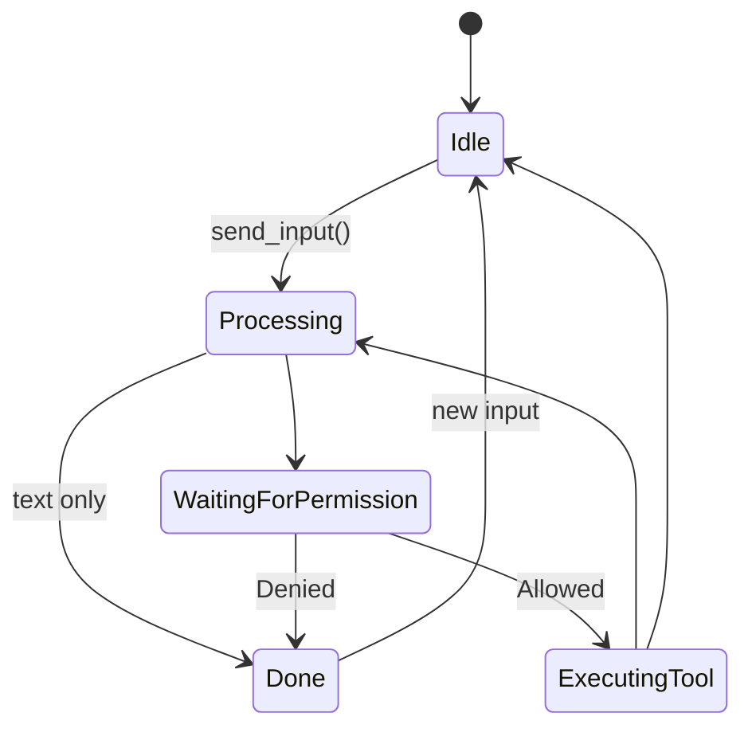
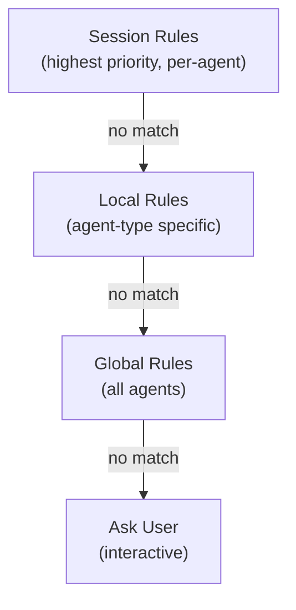

## AgentRuntime

The **AgentRuntime** is the central orchestrator that manages all agent lifecycles. It provides a registry of running agents and coordinates their execution.

### Creating a Runtime

```rust
use shadow_agent_sdk::runtime::AgentRuntime;

// Basic runtime
let runtime = AgentRuntime::new();

// Runtime with global permission rules
let runtime = AgentRuntime::with_global_rules(vec![
    PermissionRule::allow_tool("Read"),
    PermissionRule::allow_prefix("Bash", "git "),
]);
```

### Key Responsibilities

The runtime handles:

1. **Agent Spawning**: Creates new agent tasks
2. **Registry Management**: Tracks running agents by session ID
3. **Global Permissions**: Shares permission rules across all agents
4. **Lifecycle Control**: Shutdown individual or all agents

## Spawning Agents

### Basic Spawn

```rust
use shadow_agent_sdk::{
    agent::{AgentConfig, StandardAgent},
    runtime::AgentRuntime,
    session::AgentSession,
};

let runtime = AgentRuntime::new();
let session = AgentSession::new("session-id", "type", "name", "desc")?;

let config = AgentConfig::new("You are helpful");
let agent = StandardAgent::new(config, llm);

// Spawn returns an AgentHandle
let handle = runtime.spawn(session, |internals| agent.run(internals)).await;
```

### Spawn with Local Rules

Add agent-specific permission rules:

```rust
let handle = runtime.spawn_with_local_rules(
    session,
    vec![
        PermissionRule::allow_tool("Read"),
        PermissionRule::allow_prefix("Bash", "npm "),
    ],
    |internals| agent.run(internals),
).await;
```

Local rules only apply to this specific agent.

### What Happens During Spawn

1. **Task Creation**: Agent is spawned as a `tokio::task`
2. **Registry Entry**: Session ID is added to the runtime's registry
3. **Handle Creation**: Returns an `AgentHandle` for communication
4. **Async Execution**: Agent starts running in the background

```rust
// Conceptual flow
tokio::spawn(async move {
    // Agent loop starts
    loop {
        // Wait for input
        // Process with LLM
        // Execute tools
        // Send output
    }
});
```

## Agent Lifecycle States

### State Enum

```rust
pub enum AgentState {
    Idle,                           // Waiting for input
    Processing,                     // Calling LLM
    WaitingForPermission,          // Awaiting user approval
    ExecutingTool {
        tool_name: String,
        tool_use_id: String,
    },
    WaitingForSubAgent {
        session_id: String,
    },
    WaitingForUserInput {          // AskUserQuestion
        request_id: String,
    },
    Done,
    Error { message: String },
}
```

### State Transitions



### Monitoring State

```rust
// Check current state
let state = handle.state().await;

match state {
    AgentState::Idle => println!("Agent is ready"),
    AgentState::Processing => println!("Agent is thinking"),
    AgentState::WaitingForPermission => println!("Permission needed"),
    AgentState::ExecutingTool { tool_name, .. } => {
        println!("Using tool: {}", tool_name);
    }
    AgentState::Done => println!("Agent completed"),
    AgentState::Error { message } => println!("Error: {}", message),
    _ => {}
}

// Convenience methods
if handle.is_idle().await {
    // Ready for input
}

if handle.is_processing().await {
    // Busy
}

if handle.is_done().await {
    // Finished
}
```

### State Change Events

Subscribe to state changes:

```rust
let mut rx = handle.subscribe();

while let Ok(chunk) = rx.recv().await {
    match chunk {
        OutputChunk::StateChange(new_state) => {
            println!("State changed to: {:?}", new_state);
        }
        _ => {}
    }
}
```

## Registry Management

### Getting Agents

```rust
// Get a running agent by session ID
if let Some(handle) = runtime.get("session-id").await {
    handle.send_input("Continue working").await?;
}

// List all running agents
let running_ids: Vec<String> = runtime.list_running().await;

for id in running_ids {
    println!("Agent running: {}", id);
}
```

### Checking Existence

```rust
// Check if agent is running
let exists = runtime.get("session-id").await.is_some();

if !exists {
    // Spawn new agent
    let handle = runtime.spawn(...).await;
}
```

## Shutdown

### Shutdown Individual Agent

```rust
// Graceful shutdown via handle
handle.shutdown().await;

// Or via runtime
runtime.shutdown("session-id").await;
```

What happens during shutdown:
1. Agent receives `InputMessage::Shutdown`
2. Current operation completes (if safe)
3. Session is saved to disk
4. Agent task exits
5. Registry entry is removed

### Shutdown All Agents

```rust
// Shutdown all running agents
runtime.shutdown_all().await;
```

Useful for application cleanup.

### Interrupt vs Shutdown

**Interrupt** (temporary):
- Cancels current operation
- Agent stays alive
- Can receive new input

```rust
handle.interrupt().await;
// Agent is still running, just stopped current task
```

**Shutdown** (permanent):
- Terminates the agent
- Must spawn new agent to continue
- Saves final state

```rust
handle.shutdown().await;
// Agent is gone
```

## Multiple Agents

### Independent Agents

Multiple agents run completely independently:

```rust
let runtime = AgentRuntime::new();

// Spawn multiple agents
let agent1 = runtime.spawn(session1, |i| agent_a.run(i)).await;
let agent2 = runtime.spawn(session2, |i| agent_b.run(i)).await;
let agent3 = runtime.spawn(session3, |i| agent_c.run(i)).await;

// All run concurrently
agent1.send_input("Task 1").await?;
agent2.send_input("Task 2").await?;
agent3.send_input("Task 3").await?;
```

### Shared Resources

Agents can share resources safely:

```rust
// Shared LLM provider
let llm = Arc::new(AnthropicProvider::from_env()?);

// Shared tools
let tools = Arc::new(tool_registry);

// Each agent gets a clone (reference counted)
let agent1 = StandardAgent::new(config1, llm.clone());
let agent2 = StandardAgent::new(config2, llm.clone());
```

### Parent-Child Relationships

Agents can spawn subagents:

```rust
// In a custom tool
async fn execute(&self, input: &Value, internals: &mut AgentInternals) -> Result<ToolResult> {
    let parent_session = internals.session.session_id().to_string();
    let tool_use_id = internals.context.current_tool_use_id.clone().unwrap();

    // Create child session
    let child_session = AgentSession::new_subagent(
        format!("sub-{}", tool_use_id),
        "researcher",
        "Research Agent",
        "Finds information",
        &parent_session,
        &tool_use_id,
    )?;

    // Get runtime and spawn child
    if let Some(runtime) = internals.context.get_resource::<AgentRuntime>() {
        let child_handle = runtime.spawn(child_session, |i| child_agent.run(i)).await;

        // Parent can monitor child
        child_handle.send_input("Research topic X").await?;

        // Wait for completion
        let mut rx = child_handle.subscribe();
        while let Ok(chunk) = rx.recv().await {
            match chunk {
                OutputChunk::Done => break,
                _ => {}
            }
        }
    }

    Ok(ToolResult::success("Research complete"))
}
```

## Global Permissions

### Setting Global Rules

Global rules apply to ALL agents:

```rust
let runtime = AgentRuntime::with_global_rules(vec![
    PermissionRule::allow_tool("Read"),
    PermissionRule::allow_prefix("Bash", "git "),
    PermissionRule::allow_prefix("Bash", "npm "),
]);
```

### Adding Rules at Runtime

```rust
use shadow_agent_sdk::permissions::{PermissionRule, PermissionScope};

runtime.global_permissions().add_rule(
    PermissionRule::allow_tool("Grep"),
    PermissionScope::Global,
);
```

### Permission Hierarchy



## Error Handling

### Spawn Errors

```rust
match runtime.spawn(session, |i| agent.run(i)).await {
    Ok(handle) => {
        // Success
    }
    Err(e) => {
        // Handle spawn failure
        eprintln!("Failed to spawn agent: {}", e);
    }
}
```

Common spawn errors:
- Session ID already in use
- Invalid session configuration
- Resource allocation failure

### Agent Errors

Monitor for errors during execution:

```rust
let mut rx = handle.subscribe();

while let Ok(chunk) = rx.recv().await {
    match chunk {
        OutputChunk::Error(message) => {
            eprintln!("Agent error: {}", message);
            // Handle error (retry, notify user, etc.)
        }
        OutputChunk::StateChange(AgentState::Error { message }) => {
            eprintln!("Agent entered error state: {}", message);
        }
        _ => {}
    }
}
```

### Graceful Degradation

```rust
// Try to get existing agent, spawn if needed
let handle = if let Some(h) = runtime.get("session-id").await {
    h
} else {
    runtime.spawn(session, |i| agent.run(i)).await
};
```

## Thread Safety

### Runtime Cloning

The runtime is thread-safe and can be cloned:

```rust
let runtime = Arc::new(AgentRuntime::new());

// Share across threads
let runtime_clone = runtime.clone();
tokio::spawn(async move {
    let handle = runtime_clone.spawn(...).await;
});
```

### Concurrent Access

Multiple threads can safely:
- Spawn agents
- Get agents from registry
- List running agents
- Shutdown agents

Internal synchronization is handled automatically.

## Best Practices

### 1. One Runtime Per Application

```rust
// Good: Single runtime
let runtime = Arc::new(AgentRuntime::new());
// Use everywhere

// Bad: Multiple runtimes
let runtime1 = AgentRuntime::new();
let runtime2 = AgentRuntime::new();
// Agents can't see each other
```

### 2. Check Before Spawning

```rust
// Prevent duplicate agents
if runtime.get("session-id").await.is_none() {
    runtime.spawn(session, |i| agent.run(i)).await;
}
```

### 3. Clean Shutdown

```rust
// Application cleanup
runtime.shutdown_all().await;
```

### 4. Handle Errors

```rust
// Don't unwrap in production
let handle = runtime.spawn(session, |i| agent.run(i))
    .await
    .context("Failed to spawn agent")?;
```

### 5. Monitor State

```rust
// For UI feedback
tokio::spawn(async move {
    loop {
        let state = handle.state().await;
        update_ui(state);
        tokio::time::sleep(Duration::from_millis(100)).await;
    }
});
```

## Advanced Patterns

### Lazy Agent Initialization

```rust
use tokio::sync::OnceCell;

static RUNTIME: OnceCell<AgentRuntime> = OnceCell::const_new();

async fn get_runtime() -> &'static AgentRuntime {
    RUNTIME.get_or_init(|| async {
        AgentRuntime::with_global_rules(vec![
            PermissionRule::allow_tool("Read"),
        ])
    }).await
}
```

### Agent Pool

```rust
struct AgentPool {
    runtime: AgentRuntime,
    available: Arc<Mutex<Vec<String>>>,
}

impl AgentPool {
    async fn get_or_spawn(&self) -> AgentHandle {
        // Get from pool or spawn new
        let mut available = self.available.lock().await;

        if let Some(session_id) = available.pop() {
            self.runtime.get(&session_id).await.unwrap()
        } else {
            // Spawn new
            let session = AgentSession::new(...)?;
            self.runtime.spawn(session, |i| agent.run(i)).await
        }
    }

    async fn return_to_pool(&self, session_id: String) {
        self.available.lock().await.push(session_id);
    }
}
```

### Health Checks

```rust
async fn check_agent_health(runtime: &AgentRuntime, session_id: &str) -> bool {
    if let Some(handle) = runtime.get(session_id).await {
        !matches!(
            handle.state().await,
            AgentState::Error { .. } | AgentState::Done
        )
    } else {
        false
    }
}
```

## Next Steps

<CardGroup cols={2}>
  <Card
    title="Sessions & Persistence"
    href="/concepts/sessions"
  >
    Learn how conversation state is persisted
  </Card>
  <Card
    title="Message Flow"
    href="/concepts/message-flow"
  >
    Understand input/output communication
  </Card>
  <Card
    title="Agent States"
    href="/concepts/states"
  >
    Deep dive into all agent states
  </Card>
  <Card
    title="AgentHandle API"
    href="/api-reference/agent-handle"
  >
    Complete handle API reference
  </Card>
</CardGroup>
