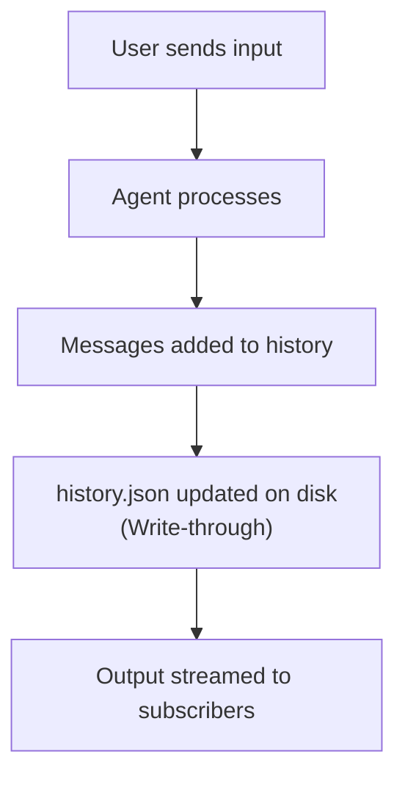

## AgentSession

The **AgentSession** manages conversation persistence. Every agent has a session that stores conversation history and metadata on disk automatically.

### Creating Sessions

```rust
use shadow_agent_sdk::session::AgentSession;

// Create new session
let session = AgentSession::new(
    "unique-session-id",  // Unique identifier
    "assistant",          // Agent type (for filtering)
    "My Assistant",       // Display name
    "Helps with tasks",   // Description
)?;

// Session is immediately persisted to disk at:
// ./sessions/unique-session-id/
```

### Session Structure

Each session creates a directory:

```
./sessions/unique-session-id/
├── metadata.json       # Session metadata
├── history.json        # Conversation messages
└── debugger/           # Debug logs (if enabled)
    ├── api_request_1.json
    ├── api_response_1.json
    ├── tool_call_1.json
    └── tool_result_1.json
```

## Metadata

### Session Metadata

```rust
pub struct SessionMetadata {
    pub session_id: String,
    pub agent_type: String,
    pub name: String,
    pub description: String,
    pub created_at: DateTime<Utc>,
    pub updated_at: DateTime<Utc>,
    pub conversation_name: Option<String>,
    pub parent_session_id: Option<String>,
    pub parent_tool_use_id: Option<String>,
    pub child_session_ids: Vec<String>,
    pub custom_metadata: HashMap<String, serde_json::Value>,
    pub model: Option<String>,
    pub provider: Option<String>,
}
```

### Accessing Metadata

```rust
// From loaded session
let session = AgentSession::load("session-id")?;
println!("Created: {}", session.metadata().created_at);
println!("Type: {}", session.metadata().agent_type);

// Without loading full session
let metadata = AgentSession::get_metadata("session-id")?;
println!("Name: {}", metadata.name);
```

### Custom Metadata

Store application-specific data:

```rust
// Through running agent
handle.set_custom_metadata("working_folder", "/path/to/project").await?;
handle.set_custom_metadata("user_preferences", serde_json::json!({
    "theme": "dark",
    "language": "en"
})).await?;

// Read it back
let folder = handle.get_custom_metadata("working_folder").await;
```

<Warning>
When an agent is running, always update metadata through the **AgentHandle** to avoid race conditions. The handle provides thread-safe access to the session.
</Warning>

## Conversation History

### Message Storage

Messages are stored as JSON:

```json
[
  {
    "role": "user",
    "content": "Hello"
  },
  {
    "role": "assistant",
    "content": [
      {
        "type": "text",
        "text": "Hi! How can I help you?"
      }
    ]
  }
]
```

### Reading History

```rust
// Get history without loading full session (efficient)
let history = AgentSession::get_history("session-id")?;

for message in history {
    match message.role.as_str() {
        "user" => println!("User: {:?}", message.content),
        "assistant" => println!("Agent: {:?}", message.content),
        _ => {}
    }
}
```

### Message Types

Messages can contain various content types:

```rust
use shadow_agent_sdk::llm::{Message, ContentBlock};

// Simple text
let msg = Message::user("Hello");

// With multiple blocks
let msg = Message::user_with_blocks(vec![
    ContentBlock::text("Analyze this code:"),
    ContentBlock::text("fn main() { println!(\"Hello\"); }"),
]);

// Tool use (from agent)
let msg = Message::assistant_with_blocks(vec![
    ContentBlock::text("I'll read that file for you."),
    ContentBlock::tool_use("tool_123", "Read", serde_json::json!({
        "file_path": "./README.md"
    })),
]);

// Tool result (from tool execution)
let msg = Message::user_with_blocks(vec![
    ContentBlock::tool_result("tool_123", "File contents...", false),
]);
```

## Write-Through Persistence

### Automatic Saving

Messages are written to disk **immediately** after each turn:



This ensures conversation state survives crashes.

### Manual Saving

Force a save (rarely needed):

```rust
session.save()?;
```

Useful if you've modified metadata directly.

## Listing Sessions

### List All Sessions

```rust
// Get all session IDs
let all_sessions = AgentSession::list_all()?;

for session_id in all_sessions {
    println!("Session: {}", session_id);
}
```

### List Top-Level Only

Filter out subagent sessions:

```rust
// Only get parent sessions
let top_level = AgentSession::list_top_level()?;

for session_id in top_level {
    println!("Top-level session: {}", session_id);
}
```

### List with Metadata

More efficient when you need metadata:

```rust
// Returns Vec<(String, SessionMetadata)>
let sessions = AgentSession::list_with_metadata(true)?;  // true = top-level only

for (session_id, metadata) in sessions {
    println!("{}: {} ({})",
        session_id,
        metadata.name,
        metadata.agent_type
    );
    println!("  Created: {}", metadata.created_at);
    println!("  Is subagent: {}", metadata.is_subagent());
}
```

## Loading Sessions

### Load Existing Session

```rust
// Load complete session from disk
let session = AgentSession::load("session-id")?;

// Access history
let messages = session.history();
println!("Message count: {}", messages.len());

// Access metadata
let metadata = session.metadata();
println!("Agent type: {}", metadata.agent_type);
```

### Check Existence

```rust
if AgentSession::exists("session-id") {
    let session = AgentSession::load("session-id")?;
} else {
    let session = AgentSession::new("session-id", "type", "name", "desc")?;
}
```

## Parent-Child Relationships

### Subagent Sessions

When agents spawn subagents, sessions are linked:

```rust
// Create child session
let child_session = AgentSession::new_subagent(
    "child-session-id",
    "researcher",
    "Research Agent",
    "Finds information",
    "parent-session-id",     // Parent session ID
    "tool_use_123",          // Parent tool use ID
)?;

// Child knows its parent
assert!(child_session.is_subagent());
assert_eq!(child_session.parent_session_id(), Some("parent-session-id"));

// Parent tracks children
let parent = AgentSession::load("parent-session-id")?;
assert!(parent.child_session_ids().contains(&"child-session-id".to_string()));
```

### Use Cases

Parent-child relationships enable:

- **Hierarchical agents**: Parent delegates to specialized children
- **Conversation trees**: Track conversation branches
- **Cleanup**: Delete parent and all children together
- **Tracing**: Follow execution across agents

## Conversation Naming

### Automatic Naming

`StandardAgent` automatically generates conversation names after the first turn:

```rust
let config = AgentConfig::new("You are helpful")
    .with_auto_name(true);  // Enabled by default

// After first turn, session gets a name like:
// "Help with Rust debugging"
// "Build a web scraper"
// "Explain async/await"
```

Disable automatic naming:

```rust
let config = AgentConfig::new("You are helpful")
    .with_auto_name(false);
```

### Manual Naming

Set conversation name explicitly:

```rust
// Through running agent
handle.set_conversation_name("Debug Python script").await?;

// Or on session directly
session.set_conversation_name("My Conversation")?;

// Check if named
if session.has_conversation_name() {
    println!("Name: {}", session.conversation_name().unwrap());
}
```

### Custom Naming LLM

Use a cheaper/faster model for naming:

```rust
let naming_llm = llm.create_variant("claude-3-5-haiku-20241022", 1024);

let config = AgentConfig::new("You are helpful")
    .with_naming_llm(naming_llm);
```

## Session Management

### Deleting Sessions

```rust
// Delete a session
session.delete()?;

// Session directory is removed from disk
```

<Warning>
Deleting a parent session does NOT automatically delete child sessions. Delete children first if needed.
</Warning>

### Updating Metadata (Running Agents)

When an agent is running, use the handle:

```rust
// Good: Thread-safe
if let Some(handle) = runtime.get("session-id").await {
    handle.set_custom_metadata("key", "value").await?;
    handle.set_conversation_name("New Name").await?;
}

// Bad: Race condition!
let mut metadata = SessionStorage::default().load_metadata("session-id")?;
metadata.set_custom("key", "value");
// Agent might overwrite this when it saves!
```

### Updating Metadata (Stopped Agents)

When agent is not running, direct access is safe:

```rust
use shadow_agent_sdk::session::SessionStorage;

let mut metadata = SessionStorage::default().load_metadata("session-id")?;
metadata.set_custom("key", "value");
SessionStorage::default().save_metadata(&metadata)?;
```

## Custom Storage Location

### Change Storage Directory

```rust
use shadow_agent_sdk::session::SessionStorage;

// Use custom directory
let storage = SessionStorage::with_dir("/custom/path/sessions");

// Create session with custom storage
let session = AgentSession::new_with_storage(
    "session-id",
    "type",
    "name",
    "desc",
    storage,
)?;
```

### Storage Interface

Implement custom storage backends:

```rust
pub trait SessionStore {
    fn save_metadata(&self, metadata: &SessionMetadata) -> Result<()>;
    fn load_metadata(&self, session_id: &str) -> Result<SessionMetadata>;
    fn save_history(&self, session_id: &str, history: &[Message]) -> Result<()>;
    fn load_history(&self, session_id: &str) -> Result<Vec<Message>>;
    fn delete(&self, session_id: &str) -> Result<()>;
    fn list_all(&self) -> Result<Vec<String>>;
}
```

Could implement:
- Database storage (PostgreSQL, SQLite)
- Cloud storage (S3, GCS)
- In-memory storage (testing)
- Encrypted storage

## Best Practices

### 1. Unique Session IDs

```rust
use uuid::Uuid;

// Generate unique IDs
let session_id = Uuid::new_v4().to_string();
let session = AgentSession::new(&session_id, "type", "name", "desc")?;
```

### 2. Meaningful Names

```rust
// Good: Descriptive
let session = AgentSession::new(
    &session_id,
    "code-assistant",
    "Python Debugger",
    "Helps debug Python code",
)?;

// Bad: Generic
let session = AgentSession::new(
    &session_id,
    "agent",
    "Agent",
    "An agent",
)?;
```

### 3. Clean Up Old Sessions

```rust
// Delete sessions older than 30 days
let sessions = AgentSession::list_with_metadata(false)?;

for (session_id, metadata) in sessions {
    let age = Utc::now() - metadata.created_at;
    if age.num_days() > 30 {
        if let Ok(session) = AgentSession::load(&session_id) {
            session.delete()?;
        }
    }
}
```

### 4. Backup Sessions

```rust
use std::fs;

// Backup session directory
let source = "./sessions/session-id";
let backup = "./backups/session-id";
fs::copy(source, backup)?;
```

### 5. Monitor Disk Usage

```rust
use walkdir::WalkDir;

fn get_sessions_size() -> u64 {
    WalkDir::new("./sessions")
        .into_iter()
        .filter_map(|e| e.ok())
        .filter(|e| e.file_type().is_file())
        .filter_map(|e| e.metadata().ok())
        .map(|m| m.len())
        .sum()
}
```

## Advanced Patterns

### Session Migrations

```rust
// Migrate old session format
let old_session = load_old_format("session-id")?;

let new_session = AgentSession::new(
    &old_session.id,
    &old_session.type_,
    &old_session.name,
    &old_session.description,
)?;

// Migrate history
for message in old_session.messages {
    new_session.add_message(convert_message(message))?;
}

new_session.save()?;
```

### Session Templates

```rust
fn create_code_assistant_session(id: &str) -> Result<AgentSession> {
    let session = AgentSession::new(
        id,
        "code-assistant",
        "Code Assistant",
        "Helps with coding tasks",
    )?;

    // Set default metadata
    session.set_custom_metadata("preferred_language", "rust")?;
    session.set_custom_metadata("max_file_size", 1024 * 1024)?;

    Ok(session)
}
```

### Session Cloning

```rust
// Clone session for branching conversations
let original = AgentSession::load("original-session")?;

let clone = AgentSession::new(
    "cloned-session",
    &original.metadata().agent_type,
    &format!("{} (clone)", original.metadata().name),
    &original.metadata().description,
)?;

// Copy history
for message in original.history() {
    clone.add_message(message.clone())?;
}

clone.save()?;
```

## Next Steps

<CardGroup cols={2}>
  <Card
    title="Message Flow"
    href="/concepts/message-flow"
  >
    Understand input/output communication patterns
  </Card>
  <Card
    title="Streaming & History"
    href="/features/streaming"
  >
    Critical dual-channel architecture
  </Card>
  <Card
    title="AgentSession API"
    href="/api-reference/agent-session"
  >
    Complete session API reference
  </Card>
  <Card
    title="Custom Storage"
    href="/advanced/custom-storage"
  >
    Implement custom storage backends
  </Card>
</CardGroup>
