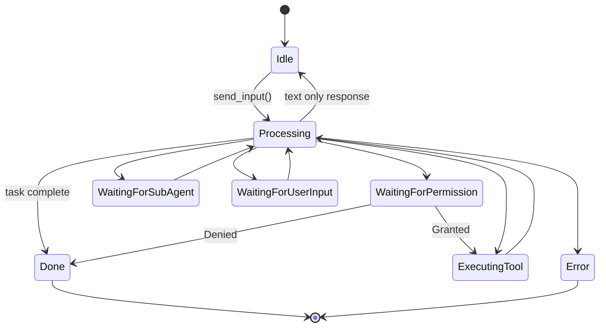

## AgentState Enum

Agents transition through various states during execution:

```rust
pub enum AgentState {
    Idle,
    Processing,
    WaitingForPermission,
    ExecutingTool {
        tool_name: String,
        tool_use_id: String,
    },
    WaitingForSubAgent {
        session_id: String,
    },
    WaitingForUserInput {
        request_id: String,
    },
    Done,
    Error {
        message: String,
    },
}
```

## State Descriptions

### Idle

**Meaning**: Agent is waiting for input

**When**:
- After spawning
- After completing a task
- Between turns

**Transitions to**:
- `Processing` (when input received)
- `Done` (when shutdown)

```rust
if handle.is_idle().await {
    // Ready to accept new input
    handle.send_input("New task").await?;
}
```

### Processing

**Meaning**: Agent is calling the LLM

**When**:
- After receiving user input
- During multi-turn conversations
- While waiting for LLM response

**Transitions to**:
- `ExecutingTool` (LLM wants to use a tool)
- `WaitingForPermission` (tool needs permission)
- `WaitingForSubAgent` (spawning subagent)
- `WaitingForUserInput` (asking user questions)
- `Idle` (text-only response complete)
- `Done` (task complete)
- `Error` (LLM call failed)

```rust
if handle.is_processing().await {
    // Show loading indicator
    ui.show_spinner();
}
```

### WaitingForPermission

**Meaning**: Tool execution requires user approval

**When**:
- LLM wants to use a tool
- No matching permission rule exists
- Interactive mode enabled

**Transitions to**:
- `ExecutingTool` (permission granted)
- `Done` (permission denied)
- `Processing` (error in permission handling)

**Payload**:
- Tool name
- Action description
- Tool input

```rust
match handle.state().await {
    AgentState::WaitingForPermission => {
        ui.show_permission_dialog();
    }
    _ => {}
}
```

### ExecutingTool

**Meaning**: Currently running a tool

**When**:
- Permission granted (or auto-allowed)
- Tool execution in progress

**Transitions to**:
- `Processing` (tool complete, continuing)
- `Done` (tool complete, task finished)
- `Error` (tool execution failed)

**Payload**:
- `tool_name`: Which tool is running
- `tool_use_id`: Unique ID for this execution

```rust
match handle.state().await {
    AgentState::ExecutingTool { tool_name, .. } => {
        ui.show_tool_indicator(&tool_name);
    }
    _ => {}
}
```

### WaitingForSubAgent

**Meaning**: Waiting for a spawned subagent to complete

**When**:
- Tool spawned a subagent
- Subagent is processing
- Parent is blocked

**Transitions to**:
- `Processing` (subagent completed)
- `Error` (subagent failed)

**Payload**:
- `session_id`: ID of the child agent

```rust
match handle.state().await {
    AgentState::WaitingForSubAgent { session_id } => {
        // Monitor subagent
        if let Some(child) = runtime.get(&session_id).await {
            let child_state = child.state().await;
            ui.show_subagent_status(&session_id, child_state);
        }
    }
    _ => {}
}
```

### WaitingForUserInput

**Meaning**: Waiting for user to answer questions

**When**:
- Agent used `AskUserQuestion` tool
- Questions sent to frontend
- Awaiting responses

**Transitions to**:
- `Processing` (answers received)
- `Done` (interrupted)

**Payload**:
- `request_id`: ID to match request/response

```rust
match handle.state().await {
    AgentState::WaitingForUserInput { request_id } => {
        ui.show_question_modal(&request_id);
    }
    _ => {}
}
```

### Done

**Meaning**: Agent has completed all work

**When**:
- Task finished successfully
- User interrupted
- Permission denied
- Shutdown requested

**Transitions to**:
- `Idle` (if new input sent)
- (Terminal state for this task)

```rust
if handle.is_done().await {
    ui.enable_input();
    ui.hide_spinner();
}
```

### Error

**Meaning**: Agent encountered an unrecoverable error

**When**:
- LLM API error
- Tool execution failure
- Internal error
- Invalid state transition

**Transitions to**:
- (Terminal state)
- `Idle` (if new input clears error)

**Payload**:
- `message`: Error description

```rust
match handle.state().await {
    AgentState::Error { message } => {
        ui.show_error(&message);
        log::error!("Agent error: {}", message);
    }
    _ => {}
}
```

## State Transitions

### Complete State Machine



### Typical Flow Examples

**Simple text response**:
```
Idle → Processing → Idle
```

**Tool execution**:
```
Idle → Processing → WaitingForPermission → ExecutingTool → Processing → Idle
```

**Multiple tools**:
```
Idle → Processing →
  ExecutingTool → Processing →
  ExecutingTool → Processing →
  Idle
```

**With subagent**:
```
Idle → Processing →
  ExecutingTool → WaitingForSubAgent →
  Processing → Idle
```

**With questions**:
```
Idle → Processing →
  WaitingForUserInput → Processing →
  Idle
```

## Monitoring State

### Polling State

```rust
use tokio::time::{interval, Duration};

let mut timer = interval(Duration::from_millis(100));

loop {
    timer.tick().await;

    let state = handle.state().await;

    match state {
        AgentState::Idle => {
            ui.show_status("Ready");
        }
        AgentState::Processing => {
            ui.show_status("Thinking...");
        }
        AgentState::ExecutingTool { tool_name, .. } => {
            ui.show_status(&format!("Using {}...", tool_name));
        }
        AgentState::Done => {
            ui.show_status("Complete");
            break;
        }
        _ => {}
    }
}
```

### Event-Driven Monitoring

```rust
let mut rx = handle.subscribe();

while let Ok(chunk) = rx.recv().await {
    match chunk {
        OutputChunk::StateChange(new_state) => {
            println!("State: {:?}", new_state);

            match new_state {
                AgentState::Processing => {
                    ui.show_spinner();
                }
                AgentState::Idle | AgentState::Done => {
                    ui.hide_spinner();
                }
                AgentState::Error { message } => {
                    ui.show_error(&message);
                }
                _ => {}
            }
        }
        _ => {}
    }
}
```

## State-Based UI Updates

### React Example (TypeScript)

```typescript
const [agentState, setAgentState] = useState<AgentState>("idle");

// Listen for state changes
listen<StateChangeEvent>("state-change", (event) => {
  setAgentState(event.payload.state);
});

// Render based on state
function AgentStatus() {
  switch (agentState) {
    case "idle":
      return <Badge color="green">Ready</Badge>;
    case "processing":
      return <Badge color="blue">Thinking...</Badge>;
    case "executing_tool":
      return <Badge color="purple">Using tool</Badge>;
    case "waiting_for_permission":
      return <Badge color="yellow">Permission needed</Badge>;
    case "done":
      return <Badge color="gray">Complete</Badge>;
    case "error":
      return <Badge color="red">Error</Badge>;
    default:
      return <Badge>Unknown</Badge>;
  }
}
```

### Tauri Backend

```rust
#[tauri::command]
async fn monitor_agent_state(
    window: tauri::Window,
    session_id: String,
    runtime: tauri::State<'_, Arc<Mutex<AgentRuntime>>>,
) -> Result<(), String> {
    let runtime = runtime.lock().await;

    if let Some(handle) = runtime.get(&session_id).await {
        tokio::spawn(async move {
            let mut rx = handle.subscribe();

            while let Ok(chunk) = rx.recv().await {
                if let OutputChunk::StateChange(state) = chunk {
                    // Emit to frontend
                    window.emit("state-change", serde_json::json!({
                        "session_id": session_id,
                        "state": state,
                    })).ok();
                }
            }
        });
    }

    Ok(())
}
```

## State Persistence

States are **not** persisted to disk. They are runtime-only:

```rust
// After restart, agent is NOT in previous state
let handle = runtime.spawn(session, |i| agent.run(i)).await;
// Always starts in Idle state

// Must reconstruct state from history if needed
let history = session.history();
// Analyze history to determine what happened
```

## Convenience Methods

The `AgentHandle` provides convenience methods:

```rust
// Check specific states
if handle.is_idle().await {
    // Agent is ready
}

if handle.is_processing().await {
    // Agent is busy
}

if handle.is_done().await {
    // Agent finished
}

// Get full state
let state = handle.state().await;
match state {
    AgentState::ExecutingTool { tool_name, .. } => {
        println!("Using tool: {}", tool_name);
    }
    _ => {}
}
```

## Error States

### Entering Error State

Agents enter error state when:

1. **LLM API fails**:
   - Network error
   - API key invalid
   - Rate limit exceeded
   - Timeout

2. **Tool execution fails**:
   - Tool threw exception
   - Invalid tool input
   - Tool not found

3. **Internal errors**:
   - Session save failed
   - Invalid state transition
   - Channel closed unexpectedly

### Recovering from Errors

```rust
match handle.state().await {
    AgentState::Error { message } => {
        eprintln!("Error: {}", message);

        // Log error
        log::error!("Agent {} failed: {}", session_id, message);

        // Notify user
        ui.show_error_dialog(&message);

        // Optionally restart
        handle.send_input("Let's try that again").await?;
        // Agent transitions back to Processing
    }
    _ => {}
}
```

## State and Interrupts

### Interrupt in Different States

**During Processing**:
- Partial text preserved
- Incomplete thinking discarded
- All tool calls removed

**During ExecutingTool**:
- Current tool completes
- Remaining tools get "Interrupted" error
- Agent transitions to Done

**During WaitingForPermission**:
- Tool gets "Interrupted" error
- No execution
- Agent transitions to Done

See [Interrupt Handling](/features/interrupts) for details.

## State Debugging

### Enable State Logging

```rust
use tracing::{info, debug};

let mut rx = handle.subscribe();

while let Ok(chunk) = rx.recv().await {
    match chunk {
        OutputChunk::StateChange(state) => {
            info!("State transition: {:?}", state);
        }
        _ => {}
    }
}
```

### State History

Track state history for debugging:

```rust
struct StateTracker {
    states: Vec<(DateTime<Utc>, AgentState)>,
}

impl StateTracker {
    fn record(&mut self, state: AgentState) {
        self.states.push((Utc::now(), state));
    }

    fn print_history(&self) {
        for (time, state) in &self.states {
            println!("{}: {:?}", time, state);
        }
    }
}

// Usage
let mut tracker = StateTracker { states: vec![] };
let mut rx = handle.subscribe();

while let Ok(chunk) = rx.recv().await {
    if let OutputChunk::StateChange(state) = chunk {
        tracker.record(state);
    }
}

tracker.print_history();
```

## Best Practices

### 1. Always Handle Error State

```rust
match handle.state().await {
    AgentState::Error { message } => {
        // Don't ignore errors!
        handle_error(&message);
    }
    _ => {}
}
```

### 2. Show State to Users

```rust
// Visual feedback improves UX
match handle.state().await {
    AgentState::Processing => ui.show_spinner(),
    AgentState::ExecutingTool { tool_name, .. } => {
        ui.show_tool_badge(&tool_name);
    }
    AgentState::WaitingForPermission => {
        ui.pulse_permission_button();
    }
    _ => ui.hide_indicators(),
}
```

### 3. Don't Poll Too Frequently

```rust
// Good: 100ms is fine
let mut timer = interval(Duration::from_millis(100));

// Bad: Too frequent, wastes CPU
let mut timer = interval(Duration::from_millis(10));
```

### 4. Use Event-Driven When Possible

```rust
// Better than polling
let mut rx = handle.subscribe();

while let Ok(chunk) = rx.recv().await {
    if let OutputChunk::StateChange(state) = chunk {
        update_ui(state);
    }
}
```

### 5. Handle All States

```rust
match handle.state().await {
    AgentState::Idle => { /* ... */ }
    AgentState::Processing => { /* ... */ }
    AgentState::WaitingForPermission => { /* ... */ }
    AgentState::ExecutingTool { .. } => { /* ... */ }
    AgentState::WaitingForSubAgent { .. } => { /* ... */ }
    AgentState::WaitingForUserInput { .. } => { /* ... */ }
    AgentState::Done => { /* ... */ }
    AgentState::Error { .. } => { /* ... */ }
}
```

## Next Steps

<CardGroup cols={2}>
  <Card
    title="Streaming & History"
    href="/features/streaming"
  >
    Understand the dual-channel pattern
  </Card>
  <Card
    title="Interrupt Handling"
    href="/features/interrupts"
  >
    Learn about graceful cancellation
  </Card>
  <Card
    title="AgentState API"
    href="/api-reference/agent-state"
  >
    Complete state API reference
  </Card>
  <Card
    title="Error Handling"
    href="/advanced/error-handling"
  >
    Advanced error handling patterns
  </Card>
</CardGroup>
