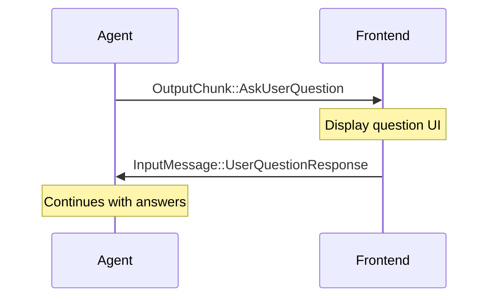

## Overview

The AskUserQuestion tool allows agents to pause execution and ask users multiple-choice questions. The agent can ask 1-4 questions at a time, each with 2-4 options, supporting both single-select and multi-select modes.

## Message Flow



## Data Structures

### Output

```rust
OutputChunk::AskUserQuestion {
    request_id: String,           // Unique ID to match request/response
    questions: Vec<UserQuestion>,
}

pub struct UserQuestion {
    pub question: String,         // Full question text
    pub header: String,           // Short label (max 12 chars)
    pub options: Vec<QuestionOption>,
    pub multi_select: bool,       // Allow multiple selections
}

pub struct QuestionOption {
    pub label: String,            // Display text (1-5 words)
    pub description: String,      // Explanation of the option
}
```

### Input (Response)

```rust
InputMessage::UserQuestionResponse {
    request_id: String,                    // Must match request
    answers: HashMap<String, String>,      // header -> selected label(s)
}
```

For multi-select questions, join multiple labels with commas: `"Option A, Option B"`.

## Example

Single-select:
```json
{
  "question": "Which database should we use?",
  "header": "Database",
  "multiSelect": false,
  "options": [
    { "label": "PostgreSQL", "description": "Relational with advanced features" },
    { "label": "SQLite", "description": "Lightweight embedded database" }
  ]
}
```

Response: `{ "Database": "PostgreSQL" }`

Multi-select:
```json
{
  "question": "Which features do you want?",
  "header": "Features",
  "multiSelect": true,
  "options": [
    { "label": "Caching", "description": "Response caching" },
    { "label": "Logging", "description": "Detailed logs" },
    { "label": "Metrics", "description": "Performance monitoring" }
  ]
}
```

Response: `{ "Features": "Caching, Metrics" }`

## Agent State

While waiting, the agent enters `AgentState::WaitingForUserInput { request_id }`. Use this to show a waiting indicator in your UI.

## Tauri Integration

### Backend

```rust
// Emit question to frontend
OutputChunk::AskUserQuestion { request_id, questions } => {
    app_handle.emit_all("ask-user-question", serde_json::json!({
        "requestId": request_id,
        "questions": questions,
    })).unwrap();
}

// Receive response from frontend
#[tauri::command]
async fn send_question_response(
    request_id: String,
    answers: HashMap<String, String>,
    state: tauri::State<'_, AgentState>,
) -> Result<(), String> {
    let handle = state.handle.lock().await;
    if let Some(h) = handle.as_ref() {
        h.send(InputMessage::UserQuestionResponse {
            request_id,
            answers,
        }).await.map_err(|e| e.to_string())?;
    }
    Ok(())
}
```

### Frontend

```typescript
// Listen for questions
listen<AskUserQuestionEvent>("ask-user-question", (event) => {
  setQuestions(event.payload.questions);
  setRequestId(event.payload.requestId);
  setShowQuestionModal(true);
});

// Send response
async function handleSubmit(answers: Record<string, string>) {
  await invoke("send_question_response", {
    requestId,
    answers,
  });
  setShowQuestionModal(false);
}
```

## Validation Rules

- **1-4 questions** per request
- **2-4 options** per question
- Headers: max 12 characters
- Labels: 1-5 words

<Warning>
If validation fails, the agent receives a tool error and may ask via a different method.
</Warning>

## Handling Cancellation

If the user cancels instead of answering, send an interrupt:

```typescript
async function handleCancel() {
  await invoke("interrupt_agent");
  setShowQuestionModal(false);
}
```

The tool returns `ToolResult::error("Interrupted")` and the agent ends the turn. See [Interrupt Handling](/features/interrupts) for details.

## Limitations

- **No custom input**: Users must choose from provided options only.
- **No nested questions**: Cannot show conditional follow-ups within one request.
- **No rich media**: Options support text only (no images or formatting).

## Next Steps

<CardGroup cols={2}>
  <Card
    title="Message Flow"
    href="/concepts/message-flow"
  >
    Communication patterns
  </Card>
  <Card
    title="Interrupt Handling"
    href="/features/interrupts"
  >
    Canceling questions
  </Card>
</CardGroup>
