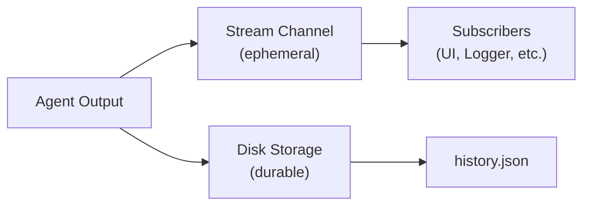

## Dual-Channel Architecture

Shadow Agent SDK uses a **dual-channel** approach for conversation data:

**1. Stream (Ephemeral)**
- Real-time output via broadcast channels
- Fast, in-memory
- Lost if no subscribers

**2. History (Persistent)**
- Disk-based storage (`history.json`)
- Durable, always available
- Source of truth for conversation state



## The Critical Pattern

<Warning>
**Subscribe BEFORE Sending Input**

Always subscribe to the output stream before sending input, or you will miss early output chunks.
</Warning>

```rust
// 1. Subscribe first
let mut rx = handle.subscribe();

// 2. Then send input
handle.send_input("Hello").await?;

// 3. Process output
while let Ok(chunk) = rx.recv().await {
    match chunk {
        OutputChunk::TextDelta(text) => print!("{}", text),
        OutputChunk::Done => break,
        _ => {}
    }
}
```

## The Foolproof UI Pattern

This pattern works for all frontend frameworks:

<Steps>
  <Step title="Load historical messages on page load">
    ```rust
    let history = AgentSession::get_history("session-id")?;
    for message in history {
        ui.display_message(message);
    }
    ```
  </Step>
  <Step title="Subscribe before sending">
    ```rust
    let mut rx = handle.subscribe();
    ```
  </Step>
  <Step title="Spawn stream processor">
    ```rust
    tokio::spawn(async move {
        while let Ok(chunk) = rx.recv().await {
            match chunk {
                OutputChunk::TextDelta(text) => ui.append_text(text),
                OutputChunk::ToolStart { name, .. } => ui.show_tool_indicator(name),
                OutputChunk::Done => {
                    ui.enable_input();
                    // Optionally refresh from disk for consistency
                    if let Ok(updated) = AgentSession::get_history("session-id") {
                        ui.refresh_history(updated);
                    }
                }
                _ => {}
            }
        }
    });
    ```
  </Step>
  <Step title="Send user input">
    ```rust
    handle.send_input(user_text).await?;
    ```
  </Step>
</Steps>

## Write-Through Persistence

Messages are written to disk immediately after each agent turn. This ensures crash recovery and consistency -- disk is always the source of truth.

## Multiple Agent Turns

A single user input can trigger multiple LLM calls (e.g., "Write hello.rs and run it" causes write, execute, and report turns). Handle this by processing until `Done`:

```rust
let mut rx = handle.subscribe();
handle.send_input("Write hello.rs and run it").await?;

while let Ok(chunk) = rx.recv().await {
    match chunk {
        OutputChunk::TextDelta(text) => print!("{}", text),
        OutputChunk::Done => break,  // All turns complete
        _ => {}
    }
}
```

## Stream vs History Content

| Stream | History |
|---|---|
| Real-time text tokens (`TextDelta`) | Complete messages (user, assistant) |
| Thinking tokens (`ThinkingDelta`) | Tool uses with inputs |
| Tool execution events (`ToolStart`, `ToolEnd`) | Tool results with outputs |
| Permission requests | Thinking blocks (complete) |
| State changes, errors | Text blocks (complete) |

If you miss stream data, fall back to history:

```rust
let history = AgentSession::get_history("session-id")?;
let last_message = history.last();
display_complete_message(last_message);
```

## Tauri Integration

### Backend (Rust)

```rust
#[tauri::command]
async fn send_message(
    window: tauri::Window,
    session_id: String,
    message: String,
    state: tauri::State<'_, AppState>,
) -> Result<(), String> {
    let handle = state.runtime.get(&session_id).await
        .ok_or("Agent not found")?;

    let mut rx = handle.subscribe();
    handle.send_input(&message).await.map_err(|e| e.to_string())?;

    tokio::spawn(async move {
        while let Ok(chunk) = rx.recv().await {
            window.emit("agent-output", &chunk).ok();
            if matches!(chunk, OutputChunk::Done | OutputChunk::Error(_)) {
                break;
            }
        }
    });

    Ok(())
}

#[tauri::command]
async fn get_history(session_id: String) -> Result<Vec<Message>, String> {
    AgentSession::get_history(&session_id).map_err(|e| e.to_string())
}
```

### Frontend (TypeScript)

```typescript
import { invoke } from '@tauri-apps/api/tauri';
import { listen } from '@tauri-apps/api/event';

// Load history on mount
const history = await invoke<Message[]>('get_history', { sessionId });
setMessages(history);

// Listen for real-time stream
listen<OutputChunk>('agent-output', (event) => {
  const chunk = event.payload;
  switch (chunk.type) {
    case 'text_delta': appendText(chunk.text); break;
    case 'tool_start': showToolIndicator(chunk.name); break;
    case 'done': enableInput(); refreshHistory(); break;
  }
});

// Send message
await invoke('send_message', { sessionId, message: text });
```

## Next Steps

<CardGroup cols={2}>
  <Card
    title="Message Flow"
    href="/concepts/message-flow"
  >
    Communication patterns
  </Card>
  <Card
    title="Tauri Integration"
    href="/integration/tauri"
  >
    Complete Tauri setup guide
  </Card>
  <Card
    title="OutputChunk Reference"
    href="/api/output-chunk"
  >
    All output chunk types
  </Card>
</CardGroup>
