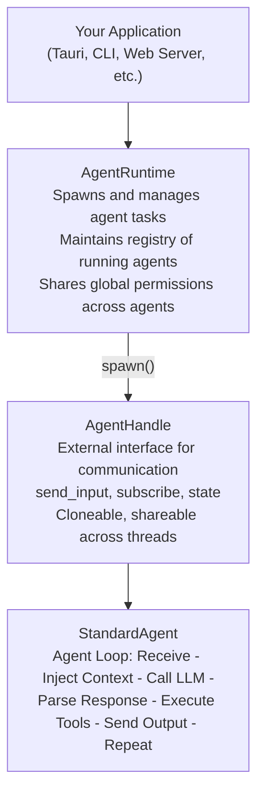

## What is Shadow Agent SDK?

Shadow Agent SDK is a **Rust framework for building AI agents** that can use tools, maintain conversations, and execute complex tasks autonomously. It's specifically designed for applications that need to spawn, manage, and communicate with multiple agents - particularly suited for **Tauri apps** and other frontend-backend architectures.

<CardGroup cols={2}>
  <Card
    title="Quick Start"
    href="/quickstart"
  >
    Build your first agent in under 5 minutes
  </Card>
  <Card
    title="Architecture"
    href="/concepts/architecture"
  >
    Understand the system design
  </Card>
  <Card
    title="Core Concepts"
    href="/concepts/runtime"
  >
    Learn how agents work
  </Card>
  <Card
    title="API Reference"
    href="/api-reference/introduction"
  >
    Complete API documentation
  </Card>
</CardGroup>

## Why Shadow Agent SDK?

### Built for Production Frontends

Unlike simple chatbot libraries, Shadow Agent SDK is designed for **real applications**:

- **Runtime Management**: Spawn and manage multiple concurrent agents
- **Session Persistence**: Automatic conversation history and state management
- **Permission System**: Three-tier security for tool execution
- **Event Streaming**: Real-time updates for responsive UIs
- **Frontend-First**: Perfect for Tauri, Electron, or web backends

### Key Features

<AccordionGroup>
  <Accordion title="Multi-LLM Support">
    Works with **Claude (Anthropic)** and **Gemini (Google)** out of the box. Swap providers at runtime or use different models for different tasks.

    ```rust
    // Use Claude
    let llm = Arc::new(AnthropicProvider::from_env()?);

    // Or Gemini
    let llm = Arc::new(GeminiProvider::from_env()?);

    // Swap at runtime
    let swappable = SwappableLlmProvider::new(fast_model);
    swappable.handle().set_provider(pro_model).await;
    ```
  </Accordion>

  <Accordion title="Tool System">
    Powerful tool system with built-in tools and easy custom tool creation:

    - **File Operations**: Read, Write, Edit, Glob, Grep
    - **Shell Access**: Bash command execution
    - **Task Management**: Built-in TODO list support
    - **Custom Tools**: Simple trait implementation
    - **MCP Integration**: Connect to external MCP servers

    Tools can spawn subagents, request permissions, and stream progress.
  </Accordion>

  <Accordion title="Automatic Prompt Caching">
    **Reduce API costs by up to 90%** with automatic prompt caching:

    - Enabled by default (no configuration needed)
    - Caches tool definitions, system prompt, and conversation history
    - Cache entries valid for 5 minutes
    - Automatic cache breakpoints at optimal locations

    Example savings: A 3-turn conversation goes from **21,000 tokens to 11,450 tokens** (46% savings, increasing with length!)
  </Accordion>

  <Accordion title="Session Management">
    Built-in conversation persistence and metadata:

    - Automatic disk persistence (write-through)
    - Parent-child session relationships (for subagents)
    - Custom metadata support
    - Conversation naming (automatic or manual)
    - Session listing and filtering
  </Accordion>

  <Accordion title="Permission System">
    Three-tier permission system for security:

    1. **Session Rules** - In-memory, highest priority
    2. **Local Rules** - Agent-type specific, persisted
    3. **Global Rules** - All agents, persisted

    User-friendly permission requests with remember capability.
  </Accordion>

  <Accordion title="Hook System">
    Intercept and modify agent behavior:

    - **PreToolUse**: Block or approve tool execution
    - **PostToolUse**: React to successful execution
    - **UserPromptSubmit**: Intercept user input
    - Pattern matching for specific tools
    - Modify tool inputs on the fly
  </Accordion>

  <Accordion title="MCP Integration">
    Full support for Model Context Protocol:

    - Dynamic tool discovery from MCP servers
    - JWT refresh with callback system
    - Automatic reconnection on server crashes
    - Multiple servers with tool namespacing
    - Thread-safe concurrent access
  </Accordion>

  <Accordion title="Advanced Features">
    Production-ready features:

    - **Streaming & History**: Dual-channel architecture for real-time + persistence
    - **Image & PDF Support**: Vision and document understanding
    - **File Attachments**: `<vibe-work-attachment>` tag support
    - **Ask User Questions**: Interactive multi-choice workflows
    - **Interrupt Handling**: Graceful cancellation in 3 scenarios
    - **Extended Thinking**: Deep reasoning with extended thinking mode
    - **Debugger**: Log all API calls and tool executions
  </Accordion>
</AccordionGroup>

## Architecture at a Glance



## Use Cases

### Perfect For

- **Tauri Desktop Apps** - Native desktop applications with AI assistants
- **CLI Tools** - Command-line agents with tool access
- **Web Backends** - Server-side agent orchestration
- **Multi-Agent Systems** - Parent agents spawning specialized subagents
- **Tool-Heavy Workflows** - Agents that need file system, shell, API access

### Not Ideal For

- Simple chatbots (too much infrastructure)
- Stateless request/response (use LLM API directly)
- Browser-only apps (Rust/WASM not optimal here)

## Comparison with Alternatives

| Feature | Shadow Agent SDK | LangChain | Anthropic SDK |
|---------|------------------|-----------|---------------|
| **Language** | Rust | Python/JS | Python/TS |
| **Runtime Management** | Built-in | Manual | Manual |
| **Session Persistence** | Automatic | Manual | None |
| **Permission System** | Three-tier | None | None |
| **Tauri Integration** | Native | Via FFI | Via FFI |
| **Multi-Agent** | First-class | Complex | Manual |
| **Type Safety** | Rust | Python | Python/TS |
| **MCP Support** | Full | Via plugins | None |
| **Streaming** | Built-in | Yes | Yes |

## Philosophy

Shadow Agent SDK is built on these principles:

1. **Frontend-First**: Designed for apps that need responsive UIs and real-time feedback
2. **Type Safety**: Leverage Rust's type system for reliability
3. **Production-Ready**: Session persistence, permissions, error handling built-in
4. **Flexible**: Multiple LLM providers, custom tools, extensible hooks
5. **Efficient**: Automatic prompt caching, connection pooling, async-first

## Getting Started

<Steps>
  <Step title="Install the SDK">
    Add to your `Cargo.toml`:
    ```toml
    [dependencies]
    shadow-agent-sdk = { path = "path/to/sdk" }
    tokio = { version = "1", features = ["full"] }
    ```
  </Step>

  <Step title="Set up environment">
    Configure your LLM provider:
    ```bash
    export ANTHROPIC_API_KEY="sk-ant-..."
    export ANTHROPIC_MODEL="claude-sonnet-4-5@20250929"
    # Or for Gemini:
    # export GEMINI_API_KEY="..."
    # export GEMINI_MODEL="gemini-3-flash-preview"
    ```
  </Step>

  <Step title="Create your first agent">
    See the [Quick Start](/quickstart) guide for a complete example
  </Step>
</Steps>

## What's Next?

<CardGroup cols={2}>
  <Card
    title="Quick Start Tutorial"
    href="/quickstart"
  >
    Build a working agent step-by-step
  </Card>
  <Card
    title="Core Concepts"
    href="/concepts/runtime"
  >
    Understand the architecture
  </Card>
  <Card
    title="Tool System"
    href="/tools/overview"
  >
    Learn about built-in and custom tools
  </Card>
  <Card
    title="Examples"
    href="/examples/basic-agent"
  >
    See complete working examples
  </Card>
</CardGroup>

## Community & Support

- **GitHub**: [Shadow Agent Framework](https://github.com/yourusername/shadow-agent-framework)
- **Issues**: Report bugs and request features
- **Examples**: See `examples/` directory in the repository

---

Ready to build your first agent? Let's get started!
