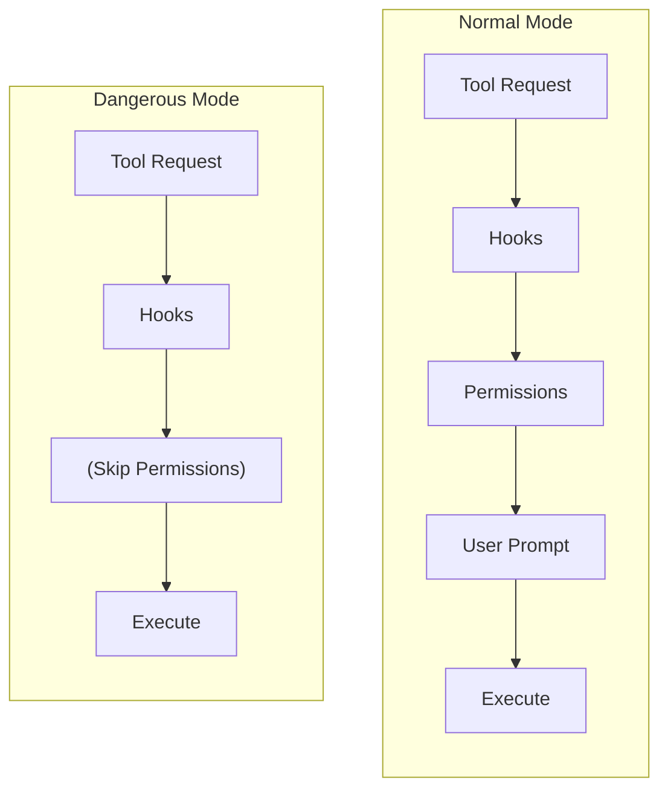

## Overview

Dangerous Skip Permissions mode bypasses the permission system entirely, allowing tools to execute immediately without user approval. This is designed for automated workflows, testing, and background tasks where interactive prompts are not possible.

<Warning>
This mode is called "dangerous" for a reason. Only use it in controlled environments with proper security hooks.
</Warning>

## How It Works

When enabled:

1. **Hooks still run** -- security hooks can still block operations
2. **Permission system bypassed** -- global/local/session rules are ignored
3. **No user prompts** -- tools execute immediately (if hooks allow)



## Enabling Dangerous Mode

### At Agent Creation

```rust
let config = AgentConfig::new("You are a helpful assistant")
    .with_tools(tools)
    .with_dangerous_skip_permissions(true)
    .with_hooks(security_hooks);  // Always use hooks as a safety net
```

### At Runtime

```rust
// Enable
handle.set_dangerous_skip_permissions(true).await?;

// Check status
let is_dangerous = handle.is_dangerous_skip_permissions_enabled().await;

// Disable (re-enable permissions)
handle.set_dangerous_skip_permissions(false).await?;
```

## When to Use

**Appropriate:**
- CI/CD pipelines
- Automated testing
- Background tasks with no UI
- Trusted server-side environments (with security hooks)

**Never use for:**
- Interactive user-facing applications
- Agents processing untrusted input
- Production environments without security hooks
- Multi-tenant applications

## Security with Hooks

<Info>
Always use security hooks with dangerous mode. Hooks are your safety net when permissions are disabled.
</Info>

```rust
let mut hooks = HookRegistry::new();

hooks.add_with_pattern(HookEvent::PreToolUse, "Bash", |ctx| {
    let cmd = ctx.tool_input.as_ref()
        .and_then(|v| v.get("command"))
        .and_then(|v| v.as_str())
        .unwrap_or("");

    if cmd.contains("rm -rf /") || cmd.contains("sudo") {
        return HookResult::deny("Dangerous command blocked");
    }

    HookResult::none()
})?;

let config = AgentConfig::new("Automation agent")
    .with_hooks(Arc::new(hooks))
    .with_dangerous_skip_permissions(true);
```

## Conditional Configuration

```rust
let is_ci = std::env::var("CI").is_ok();

let config = AgentConfig::new("Agent")
    .with_tools(tools)
    .with_dangerous_skip_permissions(is_ci);
```

## Next Steps

<CardGroup cols={2}>
  <Card
    title="Three-Tier System"
    href="/permissions/three-tier"
  >
    Normal permission system
  </Card>
  <Card
    title="Hooks"
    href="/hooks/overview"
  >
    Security hooks
  </Card>
</CardGroup>
