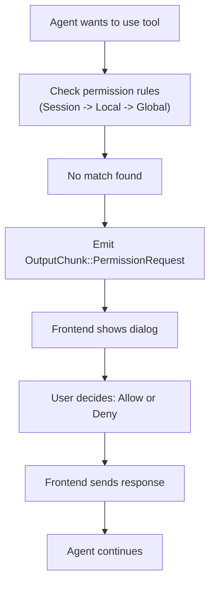

## Overview

When an agent wants to use a tool that requires permission and no rule grants access, the SDK emits an `OutputChunk::PermissionRequest`. Your frontend handles this by showing UI to the user and sending back their decision.

## Flow



## The Permission Request

```rust
OutputChunk::PermissionRequest {
    tool_name: String,           // e.g., "Bash"
    action: String,              // Human-readable: "Run command: git status"
    input: Value,                // Full tool input JSON
    details: Option<String>,     // Optional extra information
}
```

## Handling Requests

### Minimal Example

```rust
let mut rx = handle.subscribe();
handle.send_input("Check git status").await?;

while let Ok(chunk) = rx.recv().await {
    match chunk {
        OutputChunk::PermissionRequest { tool_name, action, .. } => {
            println!("Permission needed: {}", action);

            let allowed = prompt_user_approval();

            handle.send_permission_response(
                tool_name,
                allowed,
                false,  // don't remember
            ).await?;
        }

        OutputChunk::Done => break,
        _ => {}
    }
}
```

### Tauri Integration

**Backend (Rust):**

```rust
match chunk {
    OutputChunk::PermissionRequest { tool_name, action, input, details } => {
        app_handle.emit_all("permission-request", serde_json::json!({
            "toolName": tool_name,
            "action": action,
            "input": input,
            "details": details,
        })).ok();
    }
    _ => {}
}

#[tauri::command]
async fn respond_to_permission(
    tool_name: String,
    allowed: bool,
    remember: bool,
    state: tauri::State<'_, AppState>,
) -> Result<(), String> {
    let handle = state.get_handle(&session_id).await
        .ok_or("Agent not found")?;

    handle.send_permission_response(tool_name, allowed, remember)
        .await
        .map_err(|e| e.to_string())
}
```

**Frontend (TypeScript):**

```typescript
import { listen } from '@tauri-apps/api/event';
import { invoke } from '@tauri-apps/api/tauri';

listen<PermissionRequest>('permission-request', (event) => {
  const { toolName, action } = event.payload;
  showPermissionDialog(toolName, action);
});

async function handlePermissionResponse(allowed: boolean, remember: boolean) {
  await invoke('respond_to_permission', {
    toolName: permissionDialog.toolName,
    allowed,
    remember,
  });
}
```

## Remember Checkbox

When `remember` is `true` in the response, the decision is added as a **session rule** (in-memory only). It applies for the lifetime of this agent instance and is lost on shutdown.

<Info>
For persistent permissions, use local or global rules instead. See [Three-Tier System](/permissions/three-tier).
</Info>

## Next Steps

<CardGroup cols={2}>
  <Card
    title="Three-Tier System"
    href="/permissions/three-tier"
  >
    Understanding permission tiers
  </Card>
  <Card
    title="Dangerous Skip Mode"
    href="/permissions/dangerous-skip"
  >
    Bypassing permissions
  </Card>
</CardGroup>
