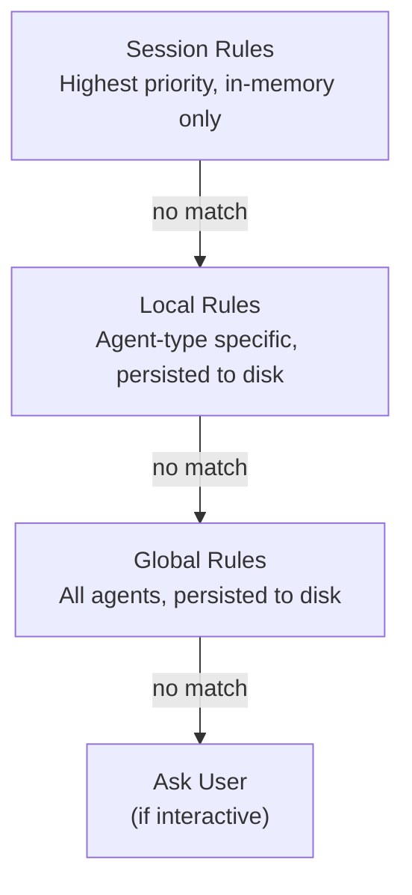

## Overview

The SDK uses a three-tier permission system to control tool access. Rules are checked in priority order:



## The Three Tiers

### Session Rules

- **Scope**: Single agent instance
- **Lifetime**: In-memory only, lost when agent shuts down
- **Use case**: Temporary permissions for specific tasks

```rust
handle.add_session_rule(PermissionRule::allow_tool("Read")).await?;
```

### Local Rules

- **Scope**: All agents of the same type
- **Lifetime**: Persisted to disk, survives restarts

```rust
let handle = runtime.spawn_with_local_rules(
    session,
    vec![
        PermissionRule::allow_tool("Read"),
        PermissionRule::allow_prefix("Bash", "git "),
    ],
    |internals| agent.run(internals),
).await;
```

### Global Rules

- **Scope**: All agents across the runtime
- **Lifetime**: Persisted to disk, survives restarts

```rust
let runtime = AgentRuntime::with_global_rules(vec![
    PermissionRule::allow_tool("Read"),
    PermissionRule::allow_tool("Glob"),
]);
```

## Priority and Fallthrough

Rules are checked in order. If no rule matches at any tier, the system asks the user (interactive mode) or denies (non-interactive mode).

```rust
// Given these rules:
// Global: allow Read
// Local: allow "git " prefix for Bash
// Session: allow Write

// Agent uses Read -> Global match, allowed
// Agent runs "git status" -> Local match, allowed
// Agent uses Write -> Session match, allowed
// Agent runs "rm file" -> No match -> Ask user
```

## Permission Rules

```rust
// Allow entire tool
PermissionRule::allow_tool("Read")

// Allow with prefix
PermissionRule::allow_prefix("Bash", "git ")

// Deny tool
PermissionRule::deny_tool("DeleteEverything")

// Deny with prefix
PermissionRule::deny_prefix("Bash", "rm -rf /")
```

## Setting Rules Programmatically

```rust
// At runtime creation
let runtime = AgentRuntime::with_global_rules(vec![
    PermissionRule::allow_tool("Read"),
    PermissionRule::allow_tool("Glob"),
    PermissionRule::deny_prefix("Bash", "rm -rf /"),
]);

// At agent spawn
let handle = runtime.spawn_with_local_rules(
    session,
    vec![
        PermissionRule::allow_prefix("Bash", "git "),
        PermissionRule::allow_prefix("Bash", "npm "),
    ],
    |internals| agent.run(internals),
).await;

// After agent is running
handle.add_session_rule(PermissionRule::allow_tool("Write")).await?;
```

## Persistence

- **Global rules**: Saved to disk at runtime shutdown
- **Local rules**: Saved to disk at agent shutdown
- **Session rules**: Never saved (in-memory only)

Default storage: `~/.shadow_agent/permissions/`

## Real-World Examples

### Safe Read-Only Agent

```rust
let runtime = AgentRuntime::with_global_rules(vec![
    PermissionRule::allow_tool("Read"),
    PermissionRule::allow_tool("Glob"),
    PermissionRule::allow_tool("Grep"),
    PermissionRule::deny_tool("Write"),
    PermissionRule::deny_tool("Edit"),
    PermissionRule::deny_tool("Bash"),
]);
```

### Development Assistant

```rust
let handle = runtime.spawn_with_local_rules(
    session,
    vec![
        PermissionRule::allow_prefix("Bash", "git "),
        PermissionRule::allow_prefix("Bash", "npm "),
        PermissionRule::allow_prefix("Bash", "cargo "),
        PermissionRule::deny_prefix("Bash", "rm -rf /"),
        PermissionRule::deny_prefix("Bash", "sudo "),
    ],
    |i| dev_agent.run(i),
).await;
```

## Limitations

- **Session rules are not persisted** -- they disappear when the agent shuts down.
- **No partial matching** -- rules are prefix-based or exact match only (no regex).
- **No user-specific rules** -- all rules apply to all users of the application.

## Next Steps

<CardGroup cols={2}>
  <Card
    title="Handling Requests"
    href="/permissions/handling"
  >
    UI patterns for permissions
  </Card>
  <Card
    title="Dangerous Skip Mode"
    href="/permissions/dangerous-skip"
  >
    Bypassing permissions
  </Card>
  <Card
    title="Hooks"
    href="/hooks/overview"
  >
    Security hooks
  </Card>
</CardGroup>
